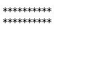
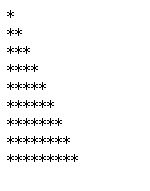

# 03-javaScript基础

- ### while循环

> ### 语法

```javascript
while(条件表达式) {
    代码（循环体）
}
```

> ### 执行过程

```javascript
 1.  先条件判断结构是 true 还是 false
 2.  如果是true，那么程序会一直执行循环体中的代码
 3.  如果条件为false，那么程序会立即跳出循环体代码结束执行
```

- ### 案例：

  ​    打印100以内 7的倍数
      打印100以内所有偶数的个数【定义一个变量用来统计个数】
      打印100以内所有偶数的和【定义一个变量用来保存总和】
  作业：
      打印100以内的奇数
      打印100以内的奇数的和

- ### do .. while 循环

> ### 语法

```javascript
do {
    循环体代码
}while(条件表达式)
```

> ### 执行过程

```javascript
 ☞  先执行循环体代昂
 ☞ 然后判断条件
 ☞ 如果条件为true，继续执行循环体代码
 ☞ 如果条件为false,循环体代码立即结束，跳出循环

 与while循环的区别：
 	 1. 如果条件不满足，do while循环会比while循环多执行一次
     2. 如果条件满足，do while循环和while循环执行的次数是一样一样的。
```

### 案例：

```
求100以内所有3的倍数的和
使用do-while循环：输出询问“我爱你，嫁给我吧？”，选择“你喜欢我吗？(y/n):"，如果输入为y则打印”我们形影不离“，若输入为n,则继续询问 
```

## for循环

### 语法

```javascript
☞  如果能明确循环次数，推荐使用for循环， 如果循环次数不确定，可以使用while获取do while循环
for (变量初始化; 条件表达式 ;  变量自增（变量自减）) {
     循环体代码
}
for(变量初始化;条件判断;变量改变){//循环体}
```

### 执行过程

```javascript
1. 先执行变量初始化
2. 条件判断，结构是否为true
3. 如果条件为true，进入循环体中执行代码 【如果条件为false，循环立即结束】
4. 变量自增或自减  --   条件判断   --  true  --- 执行代码
```

### 案例演示

```javascript
1. 计算1到100的和
2. 将1到100之间所有是6的倍数的数字输出到控制台中
3. 在页面中打印两行10颗*
4. 打印直角三角形
5. 在页面中打印99乘法表
```






## continue语句

### 特点

```javascript
 1.  当程序遇到continue的时候，会结束本次循环，后面的代码也不会执行。进入到下一次循环中。
```


## break语句

### 特点

```javascript
 1. 当程序遇到break语句的时候，程序会立即终止，后面的代码不执行
```

### while,do while

while,do while：不确定循环次数

for：次数确定


## 数组

```javascript
 思考如果我们希望同时保存多条数据该怎么办？【例如：如何将班上所有学生姓名保存起来】
 多个数据组合
```

### 学习数组的意义？

```javascript
 ☞ 数组： 可以一次保存多条数据， 数组也是一个用来保存数据的容器。
```

### 学习数组

> ### 创建数组
>
> - ### 构造函数创建数组（不讲）
>
>   ```javascript
>      var   自定义数组名称  = new Array(值，值，值);
>   ```
>
> - ### 字面量创建数组
>
>   ```javascript
>     var  自定义数组名称 = [值，值，值] ;
>   ```
>
> ### 数组赋值
>
> - ### 创建数组并赋值
>
>   ```javascript
>     ☞ 构造函数方式
>     	  var  ary = new  Array (1,2,3,5,6);
>   
>     ☞ 字面量方式赋值
>     	 var  ary = [1,2,3,4,6];
>   ```
>
> - ### 通过索引方式赋值
>
>   ```javascript
>       var  ary = [];
>   	ary[0]=1;
>   	ary[1]=2;
>   数组：[22,19,23,38,19,28]
>   下标：[0, 1, 2, 3, 4, 5]
>   取值：数组[下标]
>   赋值：数组[下标] = 值；
>   总结：
>   	 1. 数组中索引值是从 0 开始的
>        2. 通过索引的方式给数组赋值，要按照顺序个数设置
>        3. 通过  数组名.length 可以获取到当前数组的长度
>   ```
>
> ### 获取数组中的值
>
> ```javascript
>    ☞  通过索引的方式获取数组中的值，数组的索引从0开始
>    
>    ☞  语法：
> 	    数组名[索引号]
>    
>    例如：
> 	   var  ary = [1,2,3,4,5];
> 	   ary[0];
> 	   ary[1];
> var arr = [
> 			[1,2,3],
> 			[4,5,6],
> 			[7,8,9]
> 			];
> 第一行：1[0][0],2[0][1],3[0][2]
> 第二行：4[1][0],5[1][1],6[1][2]
> 第三行：7[2][0],8[2][1],9[2][2]
> ```
>
> ### 数组遍历
>
> ```javascript
> - 练习1：统计班级学生就业薪资，计算总薪资 和 平均薪资。
> - 练习3：给一个不重复的数字数组，求最大值和最大值的在数组中的位置
> 【作业】
> - 练习4：给一个不重复的数字数组，求最大值和最大值的在数组中的位置 和 最小值和最小值的在数组中的位置
> - 练习2：统计班级学生就业薪资，计算薪资超过15000的人的个数。【作业】
> - 练习5：给一个字符串数组，将数组中的每一个数据拼接在一起，每个数据之间用 | 符合拼接。 如： ‘张三|李			四|王五’
> - 练习6：给一个数字数组，该数组中有很多数字0，将不为0的数据存入到一个新的数组中【作业】
> - 练习7：给一个数组，将数组中的数据反转，存放到一个新的数组中。
> 
> 
> arr[arr.length] = 数据;
> ```
>
> ### 冒泡排序
>
> ```javascript
> 1. 给一组数字数组，将该数组中的数据排序（按照从小到大的规则） 冒泡排序
>    ☞ 排序：  按照从小到大方式排序(升序)  |  按照从大到小排序（降序）
> 
>  2. 冒泡排序
>  	  ✔ 比较  	（遍历）
>       ✔ 交换位置   （找一个中间变量）
> ```


