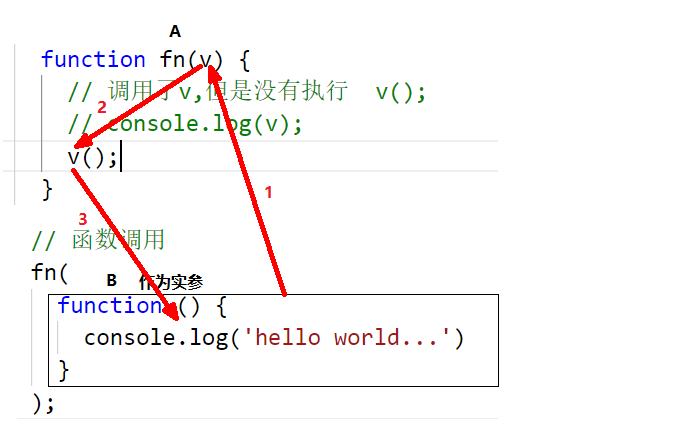
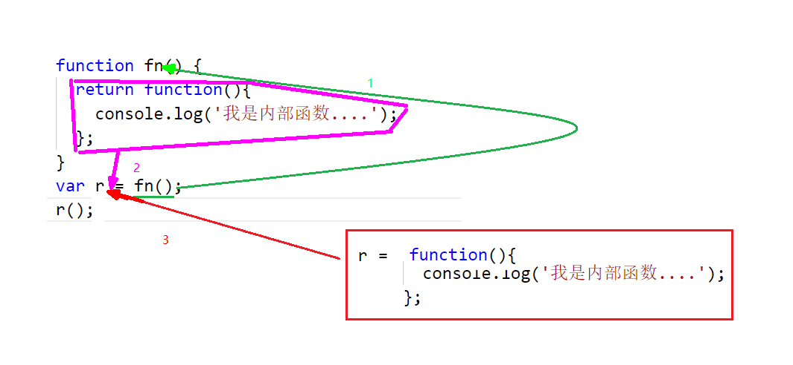
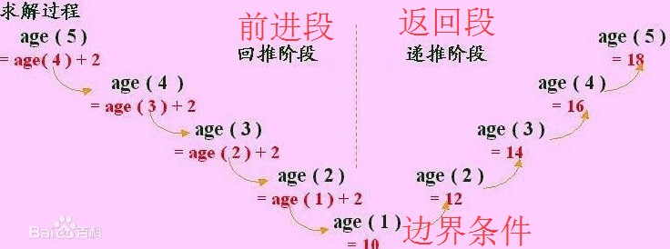

# 函数高阶

## 核心知识点

+ 函数作为参数和返回值
+ 闭包的现象和用途
+ 递归以及递归的用途


## 一. 函数作为参数和返回值

### 1.1 函数作为函数的参数

> 回调函数
>
> 本质：实参和形参的关系。只不过现在实参是一个匿名函数而已（以前实参经常是数字、布尔值、对象等等）。

​	当**调用一个函数A时**，需要**向函数A内部传入一段程序时**，可以选择将**一个函数B**当做**实参**传递给**另一个函数A**的**形参**，并在另一个函数中执行。

+ 代码

  > ```javascript
  >     //【5. 实参是函数时】
  >     // 问题：函数是一种数据类型吗？
  >     // 答： 是。   Function
  >     // 实参可以是任何的数据类型。
  >     function fn(v) {
  >       v();
  >     }
  >     // 函数调用
  >     fn( 
  >       function () {
  >         console.log('hello world...')
  >       }
  >     );
  > ```

+ 图解

  

+ 案例

  > 模拟动画完成后


### 1.2 函数作为函数的返回值

​	在程序中，有时，在调用一个函数时，需要返回一个新的函数来实现功能。比如之前学习的bind方法调用完后返回一个新的函数。

> 本质：利用了return关键在 在函数内部返回了一个函数。

+ 代码

  > ```javascript
  >     function fn() {
  >       return function(){
  >         console.log('我是内部函数....');
  >       };
  >     }
  >     var r = fn();
  >     r();
  > ```

+ 图解


    


## 二. 闭包【了解】

### 2.1 作用域【回顾】

作用域：变量的使用范围

+ 全局作用域（全局变量的生命周期）

+ 局部作用域（局部变量的生命周期）

+ 作用域链


### 2.2 什么是闭包

**闭包(Closure)**：闭包是函数和声明该函数的词法环境的组合。

- 闭包就是能够读取/设置其他函数内部变量的函数，
- 闭包就是将函数内部和函数外部连接起来的一座桥梁


### 2.3 闭包的用途

- 可以在函数外部读取函数内部成员
- 让函数内成员始终存活在内存中(延长局部变量的生命周期)
- 维护私有变量的安全（通过取款机向银行取钱、存钱、查看余额）


### 2.4 课堂一练

+ 案例1：闭包经典案例，在页面上有一组元素（如按钮），点击哪个元素就显示哪个元素的索引

+ 案例2：看代码说出结果，并分析

  ```javascript
  var name = "The Window";
  var object = {
    name: "My Object",
    getNameFunc: function () {
      return function () {
        console.log(this.name)
      };
    }
  };
  var fn = object.getNameFunc();
  fn();
  ```

+ 案例3：看代码说出结果，并分析

  ```javascript
  var name = "The Window";　　
  var object = {　　　　
    name: "My Object",
    getNameFunc: function () {
      var that = this; 
      return function () {
        console.log(that.name);
      };
    }
  };
  var fn = object.getNameFunc();
  window.fn();
  ```


## 三. 递归 【了解】

### 3.1 什么是递归？

+ 官方概念

  > ​	**程序调用自身的编程技巧称为递归（ recursion）**。递归做为一种[算法](https://baike.baidu.com/item/%E7%AE%97%E6%B3%95)在[程序设计语言](https://baike.baidu.com/item/%E7%A8%8B%E5%BA%8F%E8%AE%BE%E8%AE%A1%E8%AF%AD%E8%A8%80)中广泛应用。 一个过程或[函数](https://baike.baidu.com/item/%E5%87%BD%E6%95%B0)在其定义或说明中有直接或间接调用自身的一种方法，它通常把一个大型复杂的问题层层转化为一个与原问题相似的规模较小的问题来求解，递归策略只需少量的程序就可描述出解题过程所需要的多次重复计算，**大大地减少了程序的代码量** 。递归的能力在于用有限的[语句](https://baike.baidu.com/item/%E8%AF%AD%E5%8F%A5)来定义对象的[无限集合](https://baike.baidu.com/item/%E6%97%A0%E9%99%90%E9%9B%86%E5%90%88)。一般来说，递归需要有==**边界条件**== 、==**递归前进段**== 和==**递归返回段**== 。当边界条件不满足时，递归前进；当边界条件满足时，递归返回。

+ 趣味理解递归

  > 天下有奇族人姓计，长生不老。一日其孙问其父：吾之18代祖名何？
  >
  > 其父不明，父问其父
  >
  > 其父不明，父问其父
  >
  > 其父不明，父问其父
  >
  > 其父不明，父问其父
  >
  > ...
  >
  > 晌后，其18代祖回其子：你猜 
  >
  > 然其回其子：你猜
  >
  > 然其回其子：你猜
  >
  > 然其回其子：你猜
  >
  > 然其回其子：你猜
  >
  > ...
  >
  > 终，计姓末代孙知其18代祖名“你猜”
  >
  > 

### 3.2 递归的三个阶段

+ 递归前进段
+ 递归边界条件
+ 递归返回段

如：一组有规律的年龄10 、12、14、16、18、20、22、24......，求第n个人的年龄



### 2.3 递归的作用

 减少代码量。


### 2.4 课堂一练

+ 案例1：1,1,2,3,5,8..........求第n个数是多少 斐波那契数列 用递归实现【作业】
+ 案例2：浅拷贝、深拷贝


## 本章小结

> + 能够使用函数作为参数和返回值
> + 了解闭包的现象和作用
> + 了解递归的现象和作用

