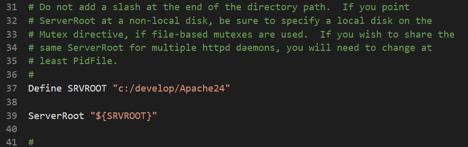
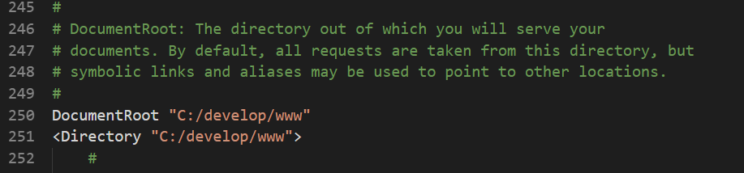
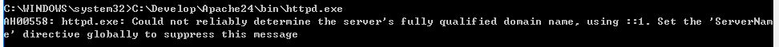
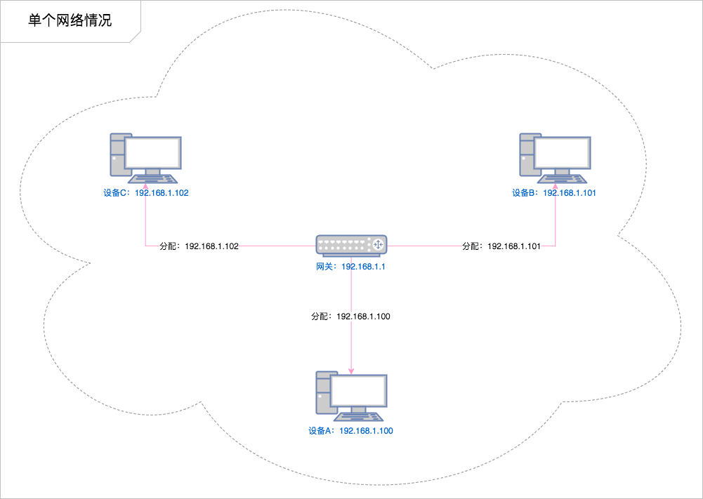
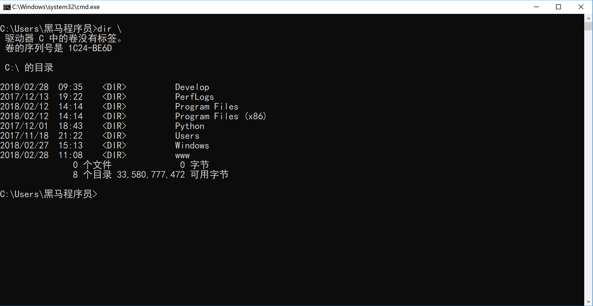
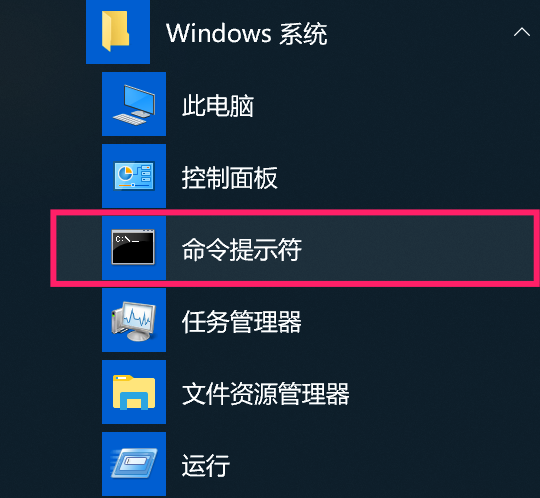
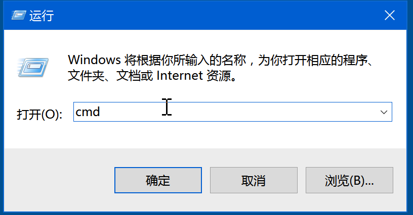
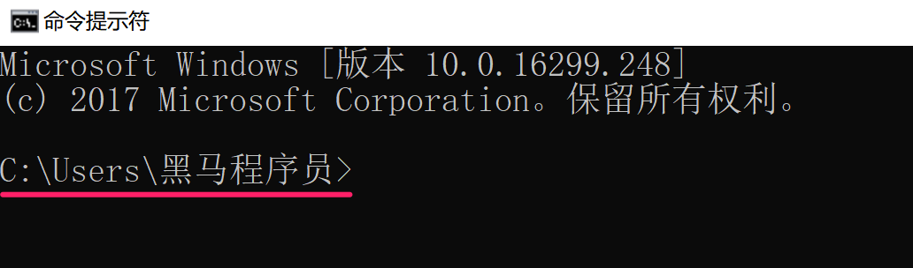
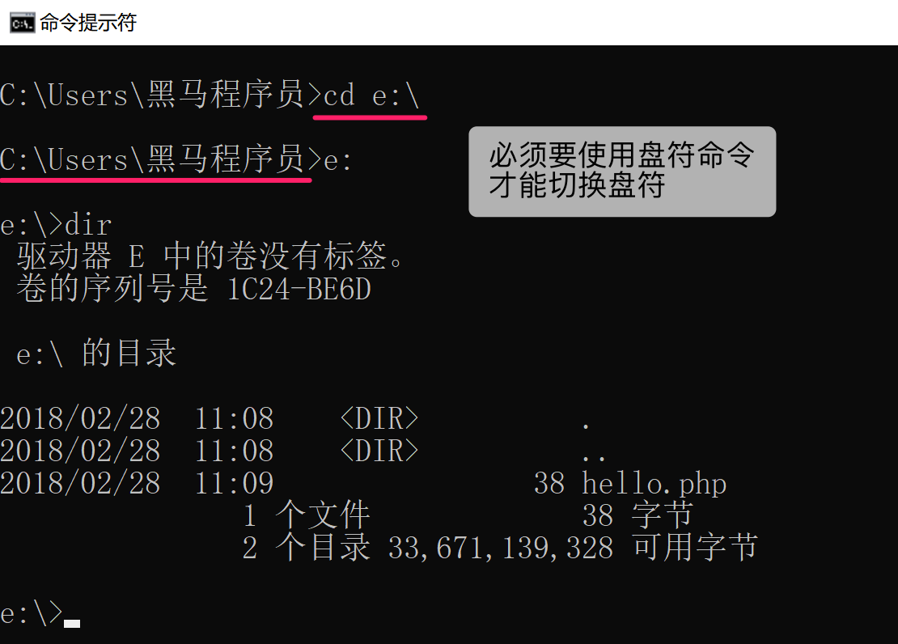
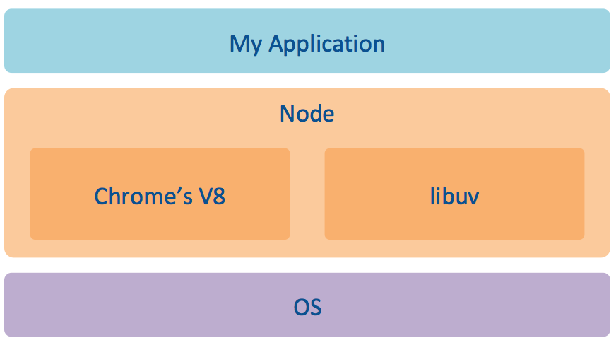

#  服务端编程 Node.js

## 浏览器的执行过程 ##

我们在浏览器地址栏中输入 www.baidu.com 是如何看到百度的？


1. 用户打开浏览器
2. 地址栏输入我们需要访问的网站网址（`URL`）
3. 浏览器通过  `DNS 服务器` 获取即将访问的网站  `IP 地址`
4. 浏览器发起一个对这个 IP地址的 `请求`
5. 服务端监听指定的 `端口` 的服务器软件接收到这个请求，**进行相应的处理**
6. 服务端将处理完的结果返回给客户端浏览器（`响应`）
7. 浏览器将服务端返回的结果呈现到界面上

## 配置 web 服务器 ##

- 过去开发的网页直接在浏览器中打开运行，如何把开发完毕的网页让其他人看到呢？

- 将自己做的网站发布到自己搭建的 web 服务器，下面我们来体验下服务器的配置：

### 安装和配置 Apache 服务器 ###

> Apache 是世界使用排名第一的 Web 服务器软件，使用广泛。

### 基本准备工作 ###

> **准备工作的目的**是为后续安装和配置 Apache **准备好目录和程序文件**。

#### 准备目录（重要） ####

在 **C 盘根目录**建立两个目录：

1. **develop**：用于存放 **Apache**的**程序文件**；
2. **develop/www**：用于存放**网站相关内容**，诸如：html、php、css、js、图像等；

> **提示**：**为了方便后续的配置操作**，建议大家**按照讲义中的名称为目录命名**。

#### 下载安装包 ####

1. 从 https://www.apachelounge.com/download/ 下载最新的 Apache 解压缩版

#### 解压缩并移动位置（重要） ####

1. 解压缩 Apache 的压缩包，将**其中**的 **`Apache24` 目录**移动到 `C:\develop` 目录下；

### 配置 Apache ###

**注意**：以下配置内容不需要记忆，大家按照讲义提示，**复制粘贴**到配置文件的对应位置即可。

#### 配置服务器目录 ####

> **服务器目录**是 `Apache` 程序文件所在的目录。

1. 使用 `Sublime` 或者 `VSCode` 打开 `C:\develop\Apache24\conf` 文件夹下的 `httpd.conf` 文件；

   **提示**：不要使用 Windows **自带的记事本**编辑 `httpd.conf` 文件。

2. **搜索并修改顶格的** `ServerRoot` 替换为以下内容：

   ```ini
   Define SRVROOT "c:/develop/Apache24"
   
   ServerRoot "${SRVROOT}"
   ```

   **如图：**

  

   **注意**：

   - 目录的斜线是 `/`（**键盘右侧 SHIFT 左边**）而不是 `\`；
     - **原因**：`/` 在 **Unix 和 Linux** 操作系统中**表示目录层级关系**。实际工作中，Apache 更多会在这两个操作系统下使用。
   - 目录的末尾不要使用 `/`。

   **提示**：

   - 配置文件中 `#` 表示注释，所以要找**顶格**的 `ServerRoot`，文件的 **37** 行（不同版本可能会有所不同）。

#### 配置文档目录 ####

> **文档目录**是**网站的根目录**，也就是使用浏览器能够浏览到这个目录中的内容。

- 在 `httpd.conf` 中**搜索并修改顶格的** `DocumentRoot` 如下：

  ```ini
  DocumentRoot "C:/develop/www"
  <Directory "C:/develop/www">
  ```

  **如图**：

  

  **提示**：文件的 **246、247** 两行（不同版本可能会有所不同）。

### 运行 Apache ###

#### 打开命令行，然后输入以下命令 ####

```bash
C:\develop\Apache24\bin\httpd.exe
```

运行成功后会有以下提示，可以先忽略

  

#### 网站配置 ####

把做好的品优购页面，放到 `c:/develop/www` 目录下(确保有 **index.html**)，然后在浏览器中输入 `http://127.0.0.1` 就可以通过服务器的方式访问我们自己制作的网站了。

## 网络的基础概念 ##

我们能够自己搭建 Web 服务器，并且看到自己制作的网站，下面来了解下 Web 开发的相关概念。

### 什么是 Web 服务器 ###

- 服务器（提供服务）指的就是一台**安装特定的软件的公共计算机**，用于专门用于提供特定的服务。
  - 按照服务类型的不同，又划分为：**Web 服务器**、数据库服务器、文件服务器等等。
  - Web 服务器，提供了 Web 服务的计算机
    - 常见的 Web 服务器软件：Apache、IIS、Tomcat
- 客户端（使用服务）指的是在一次服务过程中使用这个服务的设备（网络端点）。
  - 目前咱们最常见的客户端就是浏览器

### C/S 与 B/S ###

应用软件架构一般分为两类：

- B/S 架构：Browser（浏览器） ←→ Server（服务器），这种软件都是通过浏览器访问一个网站使用，服务器提供数据存储等服务。
- C/S 架构：Client（客户端） ←→ Server（服务器），这种软件通过安装一个软件到电脑，然后使用，服务器提供数据存储等服务。

### IP 地址 ###

> Internet Protocol Address

- 作用就是**标识一个网络设备**（计算机、手机、电视）在**某一个具体的网络**当中的地址。
- 设备在某一个网络中的地址，目前最常见的格式：`[0-255].[0-255].[0-255].[0-255]` 即为四个 0-255 的数字组成。
- 127.0.0.1 是本地回环地址

#### 单个网络情况 ####

在单个局域网下，结构非常简单，就是我们所连接的网络设备（网关）给我们分配了一个地址，在**这个范围之内**我们都可以通过这个地址找到我们的这个设备。

> 如果设备没有连接任何网络情况下，我们会有一个本地回环地址 127.0.0.1

  

#### 多个网络情况 ####

但是当一个设备同时处于多个网络下（比如同时连接了有线网卡和无线网卡），就会变得稍微复杂一点：

  

### 端口 ###

计算机本身是一个封闭的环境，就像是一个大楼，如果需要有数据通信往来，必须有门，这个门在术语中就叫端口，每一个端口都有一个编号，每台计算机只有 65536 个端口（0-65535）。

> 一般我们把“占门”的过程叫做监听
>
> **端口号的作用，是标示计算机内的某个软件**

可以通过在命令行中运行： `netstat -an` 命令监视本机端口使用情况

> 参考链接：
>
> - https://baike.baidu.com/item/%E6%9C%8D%E5%8A%A1%E5%99%A8%E7%AB%AF%E5%8F%A3
> - https://baike.baidu.com/item/%E7%AB%AF%E5%8F%A3
> - `http` 默认的端口 `80`
> - `https` 默认的端口是 `443`

### 域名 ###

由于 IP 地址都是没有规律的一些数字组成的，很难被人记住，不利于广泛传播，所以就有人想出来要给 IP 起名字（别名）。

> 域名是需要花钱注册的

#### 特殊的域名 ####

`localhost` 含义为本地主机，对应127.0.0.1 。这是一个保留域名，主要用于本地测试。

#### 顶级域名（了解） ####

.com: 商业机构 
.cn: 中国国家、地区域名 .hk,
.gov: 政府网站。
.org: 机构。
.edu: 教育网站。
.net: 网络服务商。 
.mil: 军事。

### DNS ###

通过宽带运营商提供的服务器解析一个域名背后对应的 IP，这个过程叫做 **DNS 寻址**，帮你完成 DNS 寻址过程的服务器叫做 **DNS 服务器**。

#### hosts 文件 ####

操作系统在发起对 DNS 服务器的查询请求之前，会优先检查本机的 hosts 文件。如果这个文件中包含了对当前需要解析的域名的配置，则不再发起对 DNS 服务器的请求，直接使用 hosts 文件中的配置。

**文件所在路径：**

- Windows：`C:\Windows\System32\drivers\etc\hosts`
- macOS：`/etc/hosts`

> **注意：**
>
> - 本机的 hosts 文件配置只能到影响本机的 DNS 寻址
> - 只有以管理员权限运行的编辑器才有权利修改 `hosts` 文件

### URL ###

URL（Uniform Resource Locator），统一资源定位符，通俗点来说就是表示网络当中某一个网页的完整访问地址，它具有一定的格式：

**URL作用：标示网络上的资源**

例如：http://itcast.cn:80/schools/students?id=18&name=zs#photo

​	   协议://主机地址[:端口]/路径?查询字符串#fragment

## 命令行 ##

- 学习 Node.js 离不开命令行环境

- 作为一名前端开发工程师，**日常工作是离不开命令行的**，因为有**一些工作只有通过命令才能完成**。其中包括：

  1. 使用 Node.js 开发的工具
  2. 从服务器获取或提交源代码
  3. 开启测试 Web 服务器
  4. 代码压缩、合并

  例如：**从服务器获取代码**这件工作，**可能会是我们就业进入新公司要做的第一件事情**！

  > 提示：终端命令不需要死记硬背！命令用的多，自然能记住；命令用的少，临时去百度。

### 命令行介绍 ###

在图形化的 `Windows` 操作系统问世之前，人们使用 `DOS` 操作系统来操作计算机。其界面类似于 `Windows` 系统自带的**命令行工具**，如下图所示：



> 通过命令行命令，可以执行诸如：**磁盘操作**、**文件存取**、**目录操作**、**进程管理**等操作。

### 打开命令行的方式 ###

- **方式 1**：**开始菜单**|**Windows 系统**|**命令提示符**，如下图所示：



- **方式2**：按快捷键 `win+r`，然后输入 `cmd`，如下图所示：

  

### 常用命令 ###

#### 命令格式（了解） ####

```bash
command [/options] [parameter]
```

**说明**：

- `command`：**命令名**。
  - 例如：`dir` —— 查看**当前目录**下的内容。
- `[/options]`：**命令选项**，命令的**附加控制选项**，可以省略。
  - 例如：`dir /?` —— 查看 `dir` 命令的帮助信息。
- `[parameter]`: 命令参数，命令**要操作的参数**，可以省略。
  - 例如：`dir \` —— 查看根目录 `\` 下的内容。


#### 命令行中的路径 ####

打开命令行窗口后，在**窗口的左上角位置**，会显示**当前所在的位置**，如下图所示：



使用 `dir` 命令看到的内容，会和使用**资源浏览器**查看 `C:\Users\黑马程序员`的内容一致。其中：

- `C:` 表示**盘符**；
- `\`表示**目录的层次关系**；
- `>` 在后面输入命令。

截图中的目录表示：**`C 盘` 下的 `Users` 目录下的 `黑马程序员` 目录**。

**注意**：在命令行中，单独使用的 `\`，表示**当前盘符的根目录**。

#### cd 命令 ####

| 命令        | 含义               |
| ----------- | ------------------ |
| `cd \`      | 切换到**根目录**   |
| `cd .`      | 保持在当前目录不变 |
| `cd ..`     | 切换到**上级目录** |
| `cd [目录]` | 切换到指定目录     |

#### 相对目录和绝对目录 ####

- **相对路径**：从当前目录开始的路径描述。例如：
  - `cd dev` 表示切换到当前目录下的 `dev` 目录；
  - `cd ..\css` 表示切换到上级目录下的 `css` 目录。
- **绝对路径**：从**盘符**开始的完整路径描述。例如：
  - `cd C:\Users\黑马程序员` 表示切换到 `C:\Users\黑马程序员`。

#### 切换盘符 ####

**注意**：`cd` 命令**只能切换目录，不能修改盘符**，要修改盘符，必须**使用盘符命令**。如下图所示：



**提示**：

1. 盘符的**字母不区分大小写**；
2. 盘符的冒号 `:` 后面不要使用 `\`。

#### 常用命令（掌握） ####

| 序号 | 命令                       | 英文                     | 作用                       |
| :--: | -------------------------- | ------------------------ | -------------------------- |
|  01  | `dir [目录名]`             | **dir**ectory            | 列出目录中的所有文件       |
|  02  | `cd [目录名]`              | **c**hange **d**irectory | 切换目录                   |
|  03  | `盘符:`，如：`c:`、`d:` 等 |                          | 切换盘符                   |
|  04  | `md [目录名]`              | **m**ake **d**irectory   | 创建文件夹（知道）         |
|  05  | `rd [目录名]`              | **r**emove **d**irectory | 删除文件夹（知道）         |
|  06  | `cls`                      | clear                    | 清屏                       |
|  07  | `exit`                     | **exit**                 | 退出命令行，关闭命令行窗口 |

### 小技巧（掌握） ###

- **粘贴和复制**

  - **粘贴**：**点击鼠标右键**，可以将之前在其他位置复制过的文本**粘贴到当前命令行**。

    > **提示**：从资源管理器粘贴很长的目录时尤其有用！

  - **复制**：在命令行窗口中选中一段文本后，**点击鼠标右键**，可以复制选中的文本。

- **自动补全**

  - 在敲出**文件/目录**的前几个字母后，按下 **tab** 键；
    - 如果**有以这前几个字母开头的**文件/目录，系统**会自动补全**；
    - 如果补全的文件/目录不是想要的，**可以再次按 tab 键**，会**切换下一个**文件/目录，只到切换到想要的文件/目录为止。

- **历史命令**

  - 按**上/下光标键**可以在曾经使用过的命令间来回切换；
  - 如果不想执行当前的命令可以按 **CTRL + C**。

### 小结 ###

- **本小节重点**
  1. 会打开命令行窗口，对命令行窗口建立第一印象；
  2. 知道使用 `cd` 切换目录，盘符切换磁盘；
  3. 终止正在执行的程序 `CTRL + C`，退出终端窗口 `exit`。

## Node.js 介绍 ##

### 为什么要学 Node.js ###

- 大前端必备技能
- 为了更好的学习前端框架
  - 未来我们使用的很多工具都是基于 Node.js
  - Node.js 中学习的一些概念，在框架中相似或相同
- **进一步理解 Web 开发**
- 增加职业竞争力

### Node.js 是什么 ###

以下引自 [Node.js 官网](https://nodejs.org/en/)：

> Node.js® is a JavaScript runtime built on [Chrome's V8 JavaScript engine](https://developers.google.com/v8/).

- 是  JavaScript 的，一种**运行环境**，构建于 Chrome V8 JavaScript 引擎之上

  - **运行环境**
    - 能解析和执行 JavaScript 代码（严格来说应该是 ECMAScript 代码）
    - Node 提供大量工具库api，使得 JavaScript 语言与操作系统互动（比如读写文件、网络通信）

- 为 JavaScript 提供了服务端编程的能力

  - 文件 IO
  - 网络 IO 

- Node.js 中的包管理器 `npm`，是全球最大的开源库的生态系统(有非常多的开源库可以使用)

- 从技术角度它的能力和 Java、PHP、Python、Perl、Ruby 等服务端技术类似

- Node.js 的实现

  

- 课后参考 [Node.js 简史](https://cnodejs.org/topic/555d3d54e684c4c8088a0d78)

### Node.js 特点 ###

- 事件驱动
- 非阻塞 IO（异步） 模型
- 单线程
- 跨平台

### Node.js 能做什么 ###

- Web 服务器
- 命令行工具
- 网络爬虫
- 桌面应用程序开发（Electron）
- **课外阅读**

> - Node 打破了过去 JavaScript 只能在浏览器中运行的局面
> - 前后端编程环境统一，大大降低了前后端语言切换的代价
>
> [知乎 - JavaScript能做什么，该做什么？](https://www.zhihu.com/question/20796866)
> Atwood's Law: any application that can be written in JavaScript, will eventually be written in JavaScript.
> 凡是能用 JavaScript 写出来的，最终都会用 JavaScript写出来。

### 相关参考 ###

- [Node.js 官方文档](https://nodejs.org/en/docs/)
- [Node.js 中文文档（非官方）](http://nodejs.cn/)
- [深入浅出 Node.js](https://read.douban.com/ebook/12053349/)
- [Node.js 权威指南](https://book.douban.com/subject/25892704/)
- [Node.js 实战](https://book.douban.com/subject/25870705/)
- [Node.js 实战](https://book.douban.com/subject/25867920/)
- [Node.js实战（第2季）](https://book.douban.com/subject/26642320/)
- [Node.js 中文社区](http://cnodejs.org/)
- [Node.js 包教不包会](https://github.com/alsotang/node-lessons)
- [EcmaScript 6 入门](http://es6.ruanyifeng.com/)
- [七天学会 NodeJS](https://github.com/nqdeng/7-days-nodejs)

## Node.js 的初体验 ##

### 安装 Node 环境 ###

#### 版本说明 ####

- LTS 长期支持版，适用于开发和生产环境
- Current 最新版，适用于体验测试

#### 下载 ####

- https://nodejs.org/en/download/

#### 安装 ####

一路 next 

#### 确认是否安装成功 ####

打开命令行，输入 `node --version` 或者 `node -v`。如果能看到类似于输出 `v10.14.1` 的版本号，则表示安装成功。

> 注意：如果是安装之前打开的命令行请在安装结束之后关闭重新打开再执行上述命令

### REPL ###

> 类似于浏览器中的 Console ，可以做一些基本的代码测试。
>
> - R：Read 读取
> - E：Eval 执行
> - P：Print 输出
> - L：Loop 循环

- 进入
  - 输入 `node` 回车即可
- 使用
- 离开
  - 按住 `Ctrl` 不要丢，`c` 两次即可退出


### 执行一个 js 文件 ###

- 新建一个 hello.js 并写入以下示例代码

```javascript
const message = 'Hello Node.js!';
console.log(message);
```

- 打开命令行并定位到 `hello.js` 文件所属目录
- 在命令行中输入 `node hello.js` 回车执行

> 注意：
>
> - **文件名不要起名为 `node.js**`
> - 文件名或者文件路径最好不要有中文
> - 文件路径或者文件名不要出现空格

### Node.js 中的 JavaScript ###

浏览器 JS 执行环境和 Node 执行环境的区别 

- 没有 BOM、DOM
- ECMAScript
- Node.js 为 JavaScript 提供的服务器级别的 **API** 
  - 文件读写
  - 网络通信
  - http 服务器

### 浏览器中的 JavaScript ###

- ECMAScript
- WebAPIs
  - DOM
  - BOM

### 快速体验 ###

#### 文件读写 ####

- 读文件

  ```js
  const fs = require('fs');
  
  fs.readFile('xx.txt', (err, data) => {
    if (err) throw err;
    console.log(data);
  });
  ```

- 写文件

  ```js
  const fs = require('fs');
  
  fs.writeFile('message.txt', 'Hello Node.js', (err) => {
    if (err) throw err;
    console.log('The file has been saved!');
  });
  ```

#### HTTP 服务 ####

在 Node.js 中可以轻松构建一个 Web 服务器，我们快速体验：

```js
// 1. 加载 http “工具”
const http = require('http');

// 2. 使用 http.createServer() 方法创建一个 Web 服务器
//    返回一个 Server 实例
const server = http.createServer();

// 3. 注册 request 请求事件
//    当客户端请求过来，就会自动触发服务器的 request 请求事件，然后执行第二个参数：回调处理函数
server.on('request', function (req, res) {
  res.end('Hello Node.js!');
});

// 4. 绑定端口号，启动服务器
server.listen(3000, function () {
  console.log('服务器启动成功，请求访问 http://127.0.0.1:3000/');
});
```

## 基于 Node.js 的工具 ##

### npm ###

#### 什么是 `npm` ####

- `npm` 全称 `Node Package Manager`(Node 包管理器)，它的诞生是为了解决 Node 中第三方包共享的问题。
- `npm` 是不需要单独安装。在安装 Node 的时候，会连带一起安装 `npm`。
- `npm` [官网](https://www.npmjs.com/)
  - 每星期大约有 30 亿次的下载量，包含超过 600000 个 *包*

### Node.js 的全局工具演示 ###

目的：演示基于 Node.js 开发的工具

github 世界上最大的开(同)源(性)社区(源代码托管)

- [http-server](https://github.com/indexzero/http-server)

  - 一个简单的零配置的 HTTP 服务器 (用于开发环境)

  - 安装

    ```bash
    npm install http-server -g
    ```

  - 使用

    ```bash
    http-server
    hs
    ```

- [brower-sync](http://www.browsersync.cn/)

  - 省时的浏览器同步测试工具

  - 安装

    ```bash
    npm install -g browser-sync
    ```

  - 使用

    ```bash
    # ** 代表任意目录，任意目录下的 css 或者 html 变化
    browser-sync start --server --files "**/*.css, **/*.html"+
    ```