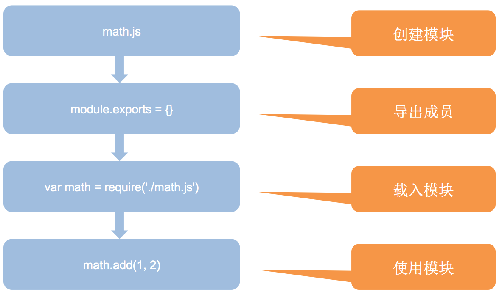

#  服务端编程

学习 Node.js 的目的是为了后续的 Web 应用开发，所以要有了解 Node.js 的开发过程。

## 全局对象和全局变量 ##

了解 Node 的最基本成员以及核心概念

[Node.js 中文文档](http://nodejs.cn/)

[Node.js 官网](https://nodejs.org/en/)

### 全局对象  ###

#### global ####

- [全局变量](http://nodejs.cn/api/globals.html)

- 类似于客户端  JavaScript 运行环境中的 window

- node.js 中的全局对象是 `global`，全局对象中的成员直接使用不需要包含它

### 全局变量 ###

- process
  - 进程：每一个 正在运行 的应用程序都称之为进程
  - 用于获取当前的 Node 进程信息，一般用于获取环境变量之类的信息
  - process.cwd()  获取 Node的**工作目录**(执行 Node 程序的目录)

- console
  - Node.js 中内置的 console 模块，提供操作控制台的输出功能，常见使用方式与客户端类似

### 全局函数 ###

- setInterval/clearInterval
- setTimeout/clearTimeout

## 模块系统 ##

- 解决恼人的命名冲突
- 解决繁琐的文件依赖

> JavaScript一直没有模块（module）体系， 无法将一个大程序拆分成互相依赖的小文件。

### 什么是模块系统 ###


- 现实角度（手机、电脑）
  - 生产效率高
  - 可维护性好

- 程序角度
  - 就是把大一个文件中很多的代码拆分到不同的小文件中，每个小文件就称之为一个模块
  - 在 node.js 中，每一个 js 文件就是一个模块
  - 每个模块有自己的作用域，**模块之间可以相互通信(相互依赖)**
  - 开发效率高
  - 可维护性好

### Node.js 中的模块化 ###

- Node.js 采用的模块化结构是按照 CommonJS 规范(CommonJS 就是一套约定标准，不是技术)

- 模块与文件是一一对应关系，即加载一个模块，实际上就是加载对应的一个模块文件

- 每一个模块都有自己的作用域

- 模块开发的流程



### 模块的通信规则 ###

#### 导出模块 `module.exports` ####

提供一个可以进行数学运算的模块，新建文件 `math.js`

```js
module.exports.add = (a, b) => {
  return a + b;
}

module.exports.sub = (a, b) => {
  return a - b;
}
```

导出模块中的成员：可以是方法也可以是属性

```js
module.exports.a = 5;
module.exports.b = 10;
```

#### 导入模块 `require` ####

导入自己写的模块，注意要使用**相对路径**

```js
// 注意 ./ 不能省略
const math = require('./math.js');
console.log(math.add(5, 5));
console.log(math.sub(5, 5));
```

#### 导出模块的其它写法 ####

- 写法一，exports 导出

  跟刚刚书写的类似，**推荐**使用这种方式，更简洁

  ```js
  exports.add = (a, b) => {
    return a + b;
  };
  exports.sub = (a, b) => {
    return a - b;
  };
  exports.a = 5;
  ```

- 写法二，module.exports 导出

  ```js
  // 1. 导出对象
  module.exports = {
    add(a, b) {
  		return a + b;
    },
    sub(a, b) {
      return a - b;
    }
  };
  
  // 2. 导出函数
  module.exports = function (a, b) {
    return a + b;
  };
  
  // 3. 导出数据
  module.exports = 5; 
  ```

  注意：导出单个模块只能使用 `module.exports`，不能使用 `exports`，见下一小结

#### require 加载模块的过程 ####

```js
const math = require('./math');
```

1. 加载 math.js 模块

2. 创建 module 对象

3. 创建 module.exports = {}，exports = module.exports

4. 执行模块中的所有代码

5. 返回(导出) module.exports 指向的对象

#### `exports`  和  `module.exports`  的区别 ####

- `module.exports`
  - 每个模块中都有一个 `module` 对象
  - module 对象中有一个 `exports` 对象，**模块最终导出的是此对象  module.exports 指向的对象**
- `exports`
  - 每一个模块中提供了一 个成员：`exports`
  - `exports` 指向了 `module.exports`，`exports = module.exports`
  - **但是 不要给  exports 直接赋值** 
  - 画图分析

### 模块内的全局环境(伪) ###

http://nodejs.cn/api/globals.html

- **__filename**
  - 用于获取当前文件所在目录的完整路径
  - 在 REPL 环境无效
- **__dirname**
  - 用来获取当前文件的完整路径
  - 在 REPL 环境同样无效
- module
  - 模块对象
  - **module.exports**  模块中最终导出的对象
  - module.id 模块的识别符，通常是带有绝对路径的模块文件名
  - module.filename 模块定义的文件的绝对路径。
- exports
  - 映射到 module.exports 的别名
- require()
  - 加载**文件模块**时候可以省略后缀名，默认加载 `.js` 文件
  - `require` 的基本功能是，读入并执行一个 JavaScript 文件，然后返回该模块的 module.exports 对象。 
  - 如果没有发现指定模块，会报错。

### 模块分类 ###

在 Node 中对模块的一个具体分类，一共就三种类别：

- 文件模块
  - 就是我们自己写的功能模块文件
- 核心模块
  - Node 平台自带的一套基本的功能模块，也有人称之为 Node 平台的 API 
- 第三方模块
  - 社区或第三方个人开发好的功能模块，可以直接拿回来用
  - 使用的时候我们需要通过 `npm` 进行下载然后才可以加载使用，例如： `moment`、`marked`

## 核心模块 ##

> 参考文档：
>
> 官网文档 https://nodejs.org/dist/latest-v10.x/docs/api/
>
> 中文文档 http://nodejs.cn/api/
>
> 学会查 API，远远比会几个 API 更重要

- 核心模块就是 Node 内置的模块，需要通过唯一的标识名称来进行获取。
- 每一个核心模块基本上都是暴露了一个对象，里面包含一些方法供我们使用
- 一般在加载核心模块的时候，变量的起名最好就和核心模块的标识名同名即可
  - 例如：`const fs = require('fs')`

### `path` 模块 ###

- http://nodejs.cn/api/path.html
- 操作文件的时候经常要对文件的路径做处理，或者获取文件的后缀，使用 `path` 模块。
- `path` 是 Node 本身提供的一个核心模块，专门用来处理路径。
- `path` 仅仅用来处理路径的字符串，不一定存在对应的物理文件。

```js
// 使用核心模块之前，首先加载核心模块
const path = require('path');
```

#### 获取后缀 ####

- path.extname()

- 获取一个路径的后缀名部分(包含.)

  ```js
  path.extname('index.html');
  // Returns: '.html'
  
  path.extname('index.coffee.md');
  // Returns: '.md'
  
  path.extname('index.');
  // Returns: '.'
  
  path.extname('index');
  // Returns: ''
  
  path.extname('.index');
  // Returns: ''
  ```

#### 拼接路径 ####

- path.join()

  - 将多个路径拼接为一个

  ```js
  path.join('/foo', 'bar', 'baz/asdf', 'quux', '..');
  // Returns: '/foo/bar/baz/asdf'
  
  path.join('foo', {}, 'bar');
  // throws 'TypeError: Path must be a string. Received {}'
  ```

- path.resolve()

  - 类似于 `path.join()` 拼接路径
  - 不同之处在于：把当前的**工作目录**作为基准目录进行拼接
    - 工作目录：当前运行 Node 程序的目录
    - 支持  / 根目录，**根目录：盘符 c:\**

  ```js
  path.resolve('/foo/bar', './baz');
  // Returns: '/foo/bar/baz'
  
  path.resolve('/foo/bar', '/tmp/file/');
  // Returns: '/tmp/file'
  
  path.resolve('wwwroot', 'static_files/png/', '../gif/image.gif');
  // if the current working directory is /home/myself/node,
  // this returns '/home/myself/node/wwwroot/static_files/gif/image.gif'
  ```

#### 常用 API ####

| 方法                       | 作用                             |
| -------------------------- | -------------------------------- |
| path.basename(path[, ext]) | 返回 path 的最后一部分(文件名)   |
| path.dirname(path)         | 返回目录名                       |
| path.extname(path)         | 返回路径中文件的扩展名(包含.)    |
| path.format(pathObject)    | 将一个对象格式化为一个路径字符串 |
| path.join([...paths])      | 拼接路径                         |
| path.parse(path)           | 把路径字符串解析成对象的格式     |
| path.resolve([...paths])   | 基于当前**工作目录**拼接路径     |

>  工作目录：当前运行 Node 程序的目录

### `fs` 模块 ###

- http://nodejs.cn/api/fs.html

- 文件系统，对文件/文件夹的操作  file system

  ```js
  // 使用核心模块前，需要导入核心模块
  const fs = require('fs');
  ```

#### 读取文件 ####

- `fs.readFile(path[, options], callback)`
  - 异步读取文件
  - options
    - 可以设置编码

#### 写入文件 ####

- `fs.writeFile(file, data[, options], callback)`

  - 文件操作的路径

  - 相对路径

    - 相对于工作目录
    - 工作目录：运行 Node.js 程序的文件夹

  - 绝对路径(**推荐**)

    ```js
    // __dirname,当前.js文件所在的目录
    path.join(__dirname, 'xx.txt');
    ```

#### 判断文件是否存在 ####

- `fs.access(path, callback)`

#### 删除文件 ####

- `fs.unlink(path, callback)`

#### 监视文件的变化 ####

- `fs.watchFile(filename[, options], listener)`

  - options
    - `interval`  轮询文件的时间间隔，默认 5007

  ```js
  let p = path.join(__dirname, '1.md');  // 使用绝对路径
  fs.watchFile(p, { interval: 200 }, (a, b) => {
    console.log('xxxxxx');
  });
  ```

#### 常用 API ####

| API                                         | 作用              | 备注           |
| ------------------------------------------- | ----------------- | -------------- |
| fs.access(path, callback)                   | 判断路径是否存在  |                |
| fs.appendFile(file, data, callback)         | 向文件中追加内容  |                |
| fs.copyFile(src, callback)                  | 复制文件          |                |
| fs.mkdir(path, callback)                    | 创建目录          |                |
| fs.readDir(path, callback)                  | 读取目录列表      |                |
| fs.rename(oldPath, newPath, callback)       | 重命名文件/目录   |                |
| fs.rmdir(path, callback)                    | 删除目录          | 只能删除空目录 |
| fs.stat(path, callback)                     | 获取文件/目录信息 |                |
| fs.unlink(path, callback)                   | 删除文件          |                |
| fs.watch(filename[, options]\[, listener])  | 监视文件/目录     |                |
| fs.watchFile(filename[, options], listener) | 监视文件          |                |

### 常用核心模块 ###

| 模块名称                                                     | 作用           |
| ------------------------------------------------------------ | -------------- |
| [fs](https://nodejs.org/dist/latest-v10.x/docs/api/fs.html)  | 文件操作       |
| [http](https://nodejs.org/dist/latest-v10.x/docs/api/http.html) | 网络操作       |
| [path](https://nodejs.org/dist/latest-v10.x/docs/api/path.html) | 路径操作       |
| [url](https://nodejs.org/dist/latest-v10.x/docs/api/url.html) | url 地址操作   |
| [os](https://nodejs.org/dist/latest-v10.x/docs/api/os.html)  | 操作系统信息   |
| [querystring](https://nodejs.org/dist/latest-v10.x/docs/api/querystring.html) | 解析查询字符串 |
| ...                                                          | ...            |

**核心模块本质上也是文件模块**

- 核心模块已经被编译到了 node 的可执行程序，一般看不到
- 可以通过查看 node 的源码看到核心模块文件


## 第三方模块 ##

- 社区或第三方个人开发好的功能模块，可以直接拿回来用。使用之前可以去 `github` 搜索使用的规则。
- 需要使用到 `npm`
  - `npm` 是 Node.js 中自带的包管理器，是一个全局的命令行工具
  - `npm` 也是一个网站 https://npmjs.com

### 演示第三方模块 ###

- 创建项目文件夹 `demo`

- 在命令行切换到 `demo` 文件夹

- 初始化 `package.json` 

  ```bash
  # 切换到 demo 文件夹，在命令行运行(确保当前文件夹没有中文)
  npm init -y
  ```

  > 注意：**项目文件夹不能有中文**

- 安装需要的第三方模块

### moment    ###

- 一个强大的第三方模块，对日期进行处理

- [moment 官网](http://momentjs.com/)

- Node.js / 浏览器环境都可以使用

- 安装

  ```bash
  # 需要联网，通过网络下载第三方包
  npm install moment
  ```

  > 第三方包，默认被下载到 node_modules 文件夹

- 使用

  ```js
  const moment = require('moment');
  
  console.log(moment(new Date()).format('YYYY-MM-DD HH:mm:ss'));
  ```

### marked ###

- 一个 markdown 语法的编译器，能够把 markdown 语法转换成 HTML。

- [marked 官网](https://github.com/markedjs/marked)

- Node.js / 浏览器环境都可以使用

- 安装

  ```bash
  npm install marked
  ```

- 使用

  ```js
  const marked = require('marked');
  let html = marked('# Marked in the browser\n\nRendered by **marked**.');
  ```

### 案例：Markdown 文件转换器 ###

> 需求：用户编写 md 格式的文件，**实时**的编译成 html 文件

```js
// 监视文件的变化
fs.watchFile('1.md', (curr, prev) => {
  // 读取1.md的内容，保存到1.html中
  fs.readFile('1.md', 'utf-8', (err, data) => {
    let html = marked(data);
    fs.writeFile('1.html', html, (err) => {
      console.log('ok');
    });
  });
});
```

## 同步和异步 ##

### 同步和异步 ###

- sync 同步，async 异步
- I/O 操作都是耗时(阻塞)操作，例如：文件操作、网络操作
- `fs` 模块对文件的几乎所有操作都有同步和异步两种形式
  - 例如：`readFile()` 和 `readFileSync()`。
- 同步与异步文件系统调用的区别
  - **同步**调用立即执行，会**阻塞**后续代码继续执行
  - **异步**调用**不阻塞**后续代码继续执行，需要**回调函数**作为额外的参数，通常包含一个错误作为回调函数的第一个参数
  - 异步调用通过判断第一个 err 对象来处理异常
  - **异步调用结果往往通过回调函数来进行获取**

> Node 只在文件IO操作中，提供了同步调用和异步调用两种形式，两者可以结合使用，
> 但是推荐能使用异步调用解决问题的情况下，少用同步调用。

### 进程和线程(了解) ###

- 进程

  - 正在执行的应用程序
  - 一个进程至少有一个线程

- 线程

  - 用来执行应用程序中的代码 
  - 在一个进程内部，可以有很多的线程，至少有一个线程
  - 在一个线程内部，同时只可以干一件事 
  - 而且传统的开发方式大部分都是 I/O 阻塞的 
  - 所以需要多线程来更好的利用硬件资源 
  - 给人带来一种错觉：线程越多越好(线程的创建需要耗时，线程本身需要占用内存)

- Node.js 是单线程的

  - Node.js 用来执行 js 的线程只有一个

  - Node.js (libuv)内部维护了一个线程池

  - Node 中将所有的阻塞操作交给了内部实现的线程池 

  - Node 本身主线程主要就是不断的往返调度
