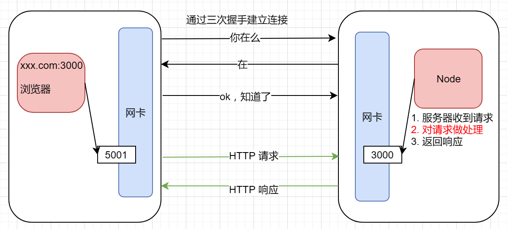

#   Web开发

## HTTP 协议 ##

### 浏览器和 Web 服务器是如何通信的？ ###

- 浏览器和 Web 服务器**通信的过程**就和**打电话的过程**一样。

  1. a 和 b 打电话，a 先要有 b 的手机号码 (IP和端口)
  2. a 给 b 拨打电话
  3. b 的电话响起，b 判断自己是否有空接听电话
  4. b 如果有空，接电话，双方可以通信(建立好通信的链接)
  5. 通信的过程双方要使用**同样的语言**说话
  6. 说话结束挂掉电话

- 浏览器和 Web 服务器通信
  1. 浏览器中输入 IP 和 端口
  2. 浏览器向**服务器**要求通信(想要建立通信的连接)
  3. 服务器判断是否有资源处理该浏览器的通信
  4. 如果服务器有资源处理，则建立一个通信的连接，通过三次握手建立连接
  5. 连接建立好以后，浏览器向服务器发送 **HTTP 请求**，服务器处理请求，并返回 **HTTP 响应**
  6. 通信结束后，服务器关闭连接

  

### HTTP 协议概述 ###

- HTTP(HyperText Transfer Protocol) 超文本传输协议

- HTTP 是一种能够获取如 HTML 这样的网络资源的 [protocol](https://developer.mozilla.org/en-US/docs/Glossary/protocol) (通讯协议)。
- 是一种 client-server 同时要遵守的协议
- 请求通常是由像浏览器这样的接受方发起的

### 请求报文 ###

- 由三部分组成：请求行、请求头、请求体

- 浏览器 请求服务器上的 index.html，如果 index.html 链接了其它文件(css/js/jpg)，浏览器再次发送请求，获取其它文件。

  
#### 请求行 ####

- 请求方法(常见的 GET 和 POST)
- 请求路径
- 协议版本

```
GET / HTTP/1.1
GET /index.html HTTP/1.1
```

#### 请求头 ####

| 键              | 值                                      |
| --------------- | --------------------------------------- |
| Host            | 请求的主机                              |
| Cache-Control   | 控制缓存（例如：max-age=60 缓存 60 秒） |
| Accept          | 客户端想要接收的文档类型，逗号分隔      |
| User-Agent      | 标识什么客户端帮你发送的这次请求        |
| Referer         | 这次请求的来源                          |
| Accept-Encoding | 可以接受的压缩编码                      |
| Cookie          | 客户端本地的小票信息                    |

- 由键值对组成

```
Host: 127.0.0.1

浏览器可以解析的文件类型
Accept: text/html,application/xhtml+xml,application/xml;q=0.9
Cookie: Hm_lvt_743362d4b71e22775786fbc54283175c=1530695737

携带了客户端的信息（操作系统和浏览器）
User-Agent: Mozilla/5.0 (Windows NT 10.0; Win64; x64) AppleWebKit/537.36 (KHTML, like Gecko) Chrome/70.0.3538.110 Safari/537.36
```

- **POST 请求的时候会有另一个请求头**

```
告诉服务器，post 过去的数据的格式长什么样子  name=zs&pwd=123456

Content-Type: application/x-www-form-urlencoded
Content-Length: 2952
```

[参考链接](https://developer.mozilla.org/zh-CN/docs/Web/HTTP/Headers)

#### 请求体 ####

- GET 请求没有请求体
- POST 请求有请求体

```
name=zs&pwd=123456
```

#### 使用 chrome 监视请求 ####


#### GET 和 POST 区别 ####

- GET
  - 获取内容
  - get 请求的时候，可以在 **url** 上携带**少量的数据**
    - http://www.baidu.com/s?wd=http&w=q
    - ?wd=http&w=q   查询字符串
  - 但是**不要**使用 get 请求携带**隐私数据**
- POST
  - 提交数据
  - POST 请求的数据，在**请求体**
  - 实现登录，**携带隐私数据**的时候，应该使用 POST 请求
  - 发送大量数据

#### 请求的方法 ####

[参考链接](https://developer.mozilla.org/zh-CN/docs/Web/HTTP/Methods)

 

### 响应报文 ###

响应报文由三部分组成：响应行、响应头、响应体

 


#### 响应行 ####

- 协议版本
- **状态码**
- 状态码描述

```
HTTP/1.1 404 Not Found
HTTP/1.1 200 OK
```

[参考链接](https://developer.mozilla.org/zh-CN/docs/Web/HTTP/Status)

#### 响应头 ####

| 键             | 值                   |
| -------------- | -------------------- |
| Date           | 响应时间             |
| Server         | 服务器信息           |
| Content-Type   | 响应体的内容类型     |
| Content-Length | 响应的内容大小       |
| Set-Cookie     | 让客户端设置一个小票 |

由键值对组成

```
Content-Length: 51866
// 服务器告诉浏览器，发送给你的是什么类型的文件
Content-Type: text/html
Server: Apache/2.4.37 (Win64)
```

#### 响应体 ####

返回的主体内容，如果请求的是网页返回网页的内容，如果请求的是图片返回图片的内容

#### 状态码 ####

##### 1xx 临时响应 #####

> 临时响应，表示临时响应并需要请求者继续执行操作的状态代码

| 状态码 | 说明                                                         |
| ------ | ------------------------------------------------------------ |
| 100    | **继续**，请求者应当继续提出请求。 服务器返回此代码表示已收到请求的第一部分，正在等待其余部分 |
| 101    | **切换协议**，请求者已要求服务器切换协议，服务器已确认并准备切换 |

##### 2xx 成功 #####

> 表示成功处理了请求的状态代码

| 状态码  | 说明                                                 |
| ------- | ---------------------------------------------------- |
| **200** | **成功**，服务器已成功处理了请求                     |
| 201     | **已创建**，请求成功并且服务器创建了新的资源         |
| 204     | **无内容**，服务器成功处理了请求，但没有返回任何内容 |
|         |                                                      |

##### 3xx 重定向 #####

> 表示要完成请求，需要进一步操作。 通常，这些状态代码用来重定向

| 状态码  | 说明                                                         |
| ------- | ------------------------------------------------------------ |
| 301     | **永久移动**，请求的网页已永久移动到新位置。 服务器返回此响应（对 GET 或 HEAD 请求的响应）时，会自动将请求者转到新位置 |
| **302** | **临时移动**，服务器目前从不同位置的网页响应请求，但请求者应继续使用原有位置来进行以后的请求 |
| **304** | **未修改**，自从上次请求后，请求的网页未修改过。 服务器返回此响应时，不会返回网页内容，从缓存中获取内容 |
| 307     | **临时重定向**，服务器目前从不同位置的网页响应请求，但请求者应继续使用原有位置来进行以后的请求 |

##### 4xx 请求错误 #####

> 表示请求可能出错，妨碍了服务器的处理

| 状态码  | 说明                                                         |
| ------- | ------------------------------------------------------------ |
| **400** | （错误请求） 服务器不理解请求的语法。                        |
| 401     | （未授权） 请求要求身份验证。 对于需要登录的网页，服务器可能返回此响应。 |
| 403     | （禁止） 服务器拒绝请求。                                    |
| 404     | （未找到） 服务器找不到请求的网页。                          |
| 405     | （方法禁用） 禁用请求中指定的方法。                          |
| 406     | （不接受） 无法使用请求的内容特性响应请求的网页。            |
| 407     | （需要代理授权） 此状态代码与 401（未授权）类似，但指定请求者应当授权使用代理。 |
| 408     | （请求超时）  服务器等候请求时发生超时。                     |
| 409     | （冲突）  服务器在完成请求时发生冲突。 服务器必须在响应中包含有关冲突的信息。 |
| 410     | （已删除）  如果请求的资源已永久删除，服务器就会返回此响应。 |
| 411     | （需要有效长度） 服务器不接受不含有效内容长度标头字段的请求。 |
| 412     | （未满足前提条件） 服务器未满足请求者在请求中设置的其中一个前提条件。 |
| 413     | （请求实体过大） 服务器无法处理请求，因为请求实体过大，超出服务器的处理能力。 |
| 414     | （请求的 URI 过长） 请求的 URI（通常为网址）过长，服务器无法处理。 |
| 415     | （不支持的媒体类型） 请求的格式不受请求页面的支持。          |
| 416     | （请求范围不符合要求） 如果页面无法提供请求的范围，则服务器会返回此状态代码。 |
| 417     | （未满足期望值） 服务器未满足”期望”请求标头字段的要求。      |

##### 5xx 服务器错误 #####

> 表示服务器在尝试处理请求时发生内部错误。 这些错误可能是服务器本身的错误，而不是请求出错

| 状态码  | 说明                                                         |
| ------- | ------------------------------------------------------------ |
| **500** | （服务器内部错误）  服务器遇到错误，无法完成请求。           |
| 501     | （尚未实施） 服务器不具备完成请求的功能。 例如，服务器无法识别请求方法时可能会返回此代码。 |
| 502     | （错误网关） 服务器作为网关或代理，从上游服务器收到无效响应。 |
| 503     | （服务不可用） 服务器目前无法使用（由于超载或停机维护）。 通常，这只是暂时状态。 |
| 504     | （网关超时）  服务器作为网关或代理，但是没有及时从上游服务器收到请求。 |
| 505     | （HTTP 版本不受支持） 服务器不支持请求中所用的 HTTP 协议版本。 |

### 应用场景 ###

#### 应用场景 ####

- 设置响应文件类型

  - `res.setHeader('Content-Type: text/css');`
  - 常见的 HTTP MIME type：`text/css` `text/html` `text/plain` `applcation/javascript`

- 下载文件

  ```
  // 让文件下载
  res.setHeader('Content-Type: application/octet-stream');
  // 设置默认下载文件名
  res.setHeader('Content-Disposition: attachment; filename=demo.txt');
  ```

- 图片防盗链

  - 通过判断请求来源 `Referer` 是否为本网站从而区分是否是合法请求

### 参考 ###

https://segmentfault.com/a/1190000006689767

## HTTP 模块 ##

### 接收浏览器发送的请求 ###

- 创建 Web 服务器的步骤
  - 导入 http 核心模块
  - 创建 server 对象(server 对象负责建立连接，接收数据)
  - 注册 request 事件，当浏览器发送请求到服务器执行，设置处理请求的函数
  - 监听端口

```javascript
// 0. 加载 http 核心模块
const http = require('http')
// 1. 创建服务器，得到 Server 实例
const server = http.createServer()
// 2. 监听客户端的 request 请求事件，设置请求处理函数
server.on('request', (request, response) => {
  // 通过 request 获取请求信息
  // request.header
  console.log('收到客户端的请求了')
})
// 3. 绑定端口号，启动服务器
server.listen(3000, function () {
  console.log('Server is running at port 3000.')
})

```

- 当服务器接收到浏览器的请求后，如果没有做出响应，浏览器会等待
- 服务器的最终目的是要根据请求做出响应
- 当收到浏览器的请求后，会调用处理请求的函数（有两个核心参数 request 和 response）
  - [request](http://nodejs.cn/api/http.html#http_class_http_incomingmessage)
    - 请求对象，浏览器发送的请求报文中的数据已经被解析到该对象上
    - **request.url**            获取请求行中的路径
    - **request.method**   获取请求行中的请求方法
    - request.headers    获取请求头
  - [response](http://nodejs.cn/api/http.html#http_class_http_serverresponse)
    - 响应对象，服务器给浏览器返回的响应内容，可以通过该对象设置
- 浏览器在请求服务器的时候，默认会请求网站根目录下的 `/favicon.ico` 网站图标

### 给浏览器发送响应 ###

- Node 服务器不同于 Apache，默认能力非常的简单，一切请求都需要自己来处理。
- 通过 response 给浏览器发送响应报文
  - response.write()  设置响应体的内容，可以多次调用。发送响应要调用 end() 方法
  - response.end()    把响应报文发送给浏览器
  - response.end(data)    设置响应体，把响应报文发送给浏览器
- 问题：在输出中文内容时候出现乱码，如何解决？

### 解决中文乱码问题 ###

- html 文件中的 `<meta charset="UTF-8" />`

  - html 文件需要如果声明了 meta-charset 则可以不写 Content-Type

- 响应头的`Content-Type`

  - 根据不同的内容类型所对应的数据也不一样，具体查询：http://tool.oschina.net/commons

  ```js
  // 设置响应头
  response.setHeader('Content-Type', 'text/html; charset=utf-8');
  ```

- 建议每个响应都告诉客户端我给你发送的 Content-Type 内容类型是什么

### 根据不同 url 地址处理不同请求 ###

- 网站中的资源都是通过 `url` 地址来定位的
- 我们可以在在请求处理函数获取客户端的请求地址
  - URL组成：协议:
    - 协议://主机地址:端口号/**路径?查询字符串**#锚
  - 根据 URL 中的 path 部分来进行处理
- 然后根据不同的请求地址做出不同的响应。

```javascript
server.on('request', (req, res) => {  
  let url = req.url

  // 通常情况下，都会把 / 当作首页
  // 因为用户手动输入地址，不加任何路径，浏览器会自动补上 / 去请求
  if (url === '/') {
    console.log('首页')
    res.end(`
<h1>首页</h1>
<ul>
<li>
  <a href="/login">登陆</a>
</li>
<li>
  <a href="/reg">注册</a>
</li>
</ul>
`)
  } else if (url === '/login') {
    console.log('登陆')
    res.end('login page')
  } else if (url === '/reg') {
    console.log('注册')
    res.end('reg page')
  } else {
    console.log('404 不认识')
    res.end('404 Not Found.')
  }
})
```

### API 总结 ###

#### 请求对象 Request ####

- url
- method
- headers

#### 响应对象 Response ####

- write
- end
- setHeader  设置请求头
- statusCode 设置状态码

## 静态 Web 服务器 ##

了解静态 Web 服务器的处理过程，未来会有第三方模块帮我们处理大部分重复的事情。

 


### 留言板案例 ###

- 准备工作

  - 把准备好的模板放到项目目录的 `views` 文件夹下
- 展示页面
  - 当请求 `/` 路径时，服务端读取对应的 `index.html` 并返回给浏览器

  ```javascript
  // 获取请求的 path
  let url = req.url;
  // 判断 path 是否是预期的值
  if (req.url === '/') {
    // 获取文件的绝对路径
    let filePath = path.join(__dirname, 'views/index.html');
    // 读取文件
    fs.readFile(filePath, 'utf8', (err, data) => {
      // 把内容返回给浏览器
      res.end(data);
    });
  }
  ```

- 测试
  - 开始服务器，在浏览器中测试
  - 浏览器一直等待的状态，监视请求

### 处理静态资源 ###

- 根据请求的路径，拼接请求文件的绝对路径

- 读取文件，发送响应

  ```js
  if (request.url === '/') {
    // 返回首页
  } else if (request.url === '/css/index.css') {
    let strPath = path.join(__dirname, 'views/images/timg.jpg');
    fs.readFile(straPath, (err, data) => {
      if (err) throw err;
      // 响应
      response.end(data);
    });
  } else if (request.url === '/images/timg.jpg') {
  } else if (request.url === '/images/lj.jpg') {
  } 
  ```

### 设置 Content-Type ###

http://tool.oschina.net/commons

建议每个响应都告诉客户端我给你发送的 Content-Type 内容类型是什么

为不同的文件类型设置不同的 Content-Type

- .html：text/html
- .css：text/css
- .js：application/javascript
- .jpg：image/jpg

```js
response.setHeader('Content-Type', 'text/css');
```

### 处理 404 ###

- 如果请求未处理的路径，服务器不会做任何的响应

- 此时浏览器处于等待状态

- 如果浏览器请求未处理的路径，统一设置响应码 `404`，并做友好提示

  ```js
  // 设置状态码为404
  response.statusCode = 404;
  response.end('对不起，您请求的页面未找到');
  ```

### 统一处理静态资源 ###

如果网页中引用的所有外部资源都需要自己判断，代码量太大，所以要简化处理

- 准备工作

  - 为了能够判断出当前的请求是否是网页中引用的外部资源给网页中的所有链接做特殊的处理

  - 给外部资源的链接添加一个前缀 `public`

    ```html
    <link rel="stylesheet" href="public/css/index.css">
    
    
    ```

  - 为了方便在服务端拼接路径，把外部资源都放到 `views/public` 目录中

- 服务端处理

  - 判断当前请求的路径是否包含 `public`

  - 如果包含 `public`请求的是静态资源，拼接资源的绝对路径

  - 读取文件，并给浏览器发送响应

    ```js
    if (request.url.includes('/public/')) {
      // 读取对应的文件，返回给浏览器
      fs.readFile(path.join('views', request.url), (err, data) => {
        if (err) throw err;
        response.end(data);
      });
    }
    ```

### 判断静态资源的 Content-Type ###

- 根据后缀名，判断资源对应的 `Content-Type`

  ```js
  let ext = path.extname(request.url);
  let contentType = '';
  // 根据后缀找到对应的content-type的值
  switch (ext) {
    case '.css':
      contentType = 'text/css';
      break;
    case '.jpg':
      contentType = 'image/jpeg';
      break;
  }
  // 设置content-type
  response.setHeader('Content-Type', contentType);
  ```


