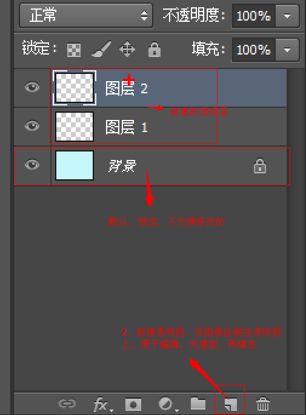
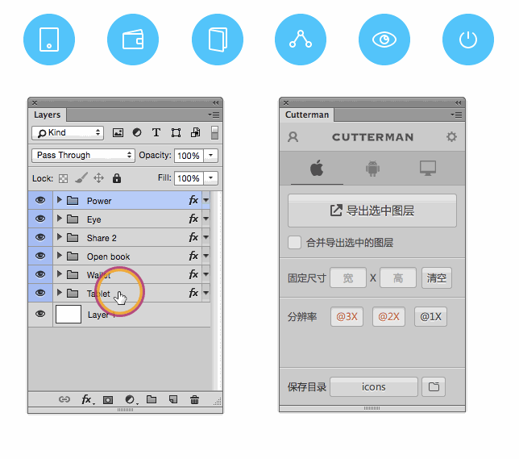

## Photoshop基本使用

## PS界面组成：

ctrl + r  显示隐藏标尺      右击 标尺 --- 把里面的单位一律改为像素

ctrl+ d  取消选区    

菜单栏、选项栏、工具栏、浮动面板（拖拽名称，可单独操作面板）、绘图窗口
​    窗口菜单，可显示隐藏所有面板

工作区：（新建）

调整浮动面板

## 图层操作(重点)

 图层面板快捷键   F7  其实图层就是一张张透明的纸  可以实现叠加问题。

 图层选择： 使用移动工具V 

 1、图层缩览图判断

 2、按住CTRL,在目标图像上单击

 3、将光标放置在目标图像上右键，选择图层名称

图层面板中加选图层：

1、按SHIFT，单击另一目标图层     中间所有图层被选中

2、按CTRL，单击另一目标图层     只选中目标图层

复制图层：选中目标图层后（移动工具状态下）

   1、按ALT拖拽图像

   2、CTRL+J      （重合）

案例： 摆放一个自行车

## 图层编组

选中目标图层，CTRL+G   

取消编组：CTRL+SHIFT+G

双击图层名称可重新命名

双击组名称，可命名组

  移动工具V选择组或图层时，需设置选项栏

## 图层上下位置移动

1、选中目标图层，在图层面拖拽

2、CTRL+]    向上移动图层
​       CTRL+[    向下移动图层

3、CTRL+SHIFT+]   图层置顶
​       CTRL+SHIFT+[   图层置底

移动选区或图像时：

移动过程中，没释放鼠标，按住SHIFT，可同一水平线、同一垂线、45度移动。

ps中的撤销操作是：

ctrl+z  撤销一步

ctrl+alt+z  撤销多步

## Photoshop 切图

PS切图 可以 分为 手动 利用切片切图 以及 利用PS的插件快速切图

### 切片工具

1. 利用切片工具手动划出

2. 图层菜单---新建基于图层的切片

3. 利用标尺   基于参考线的切片 （选择切片工具）

   ​

   

导出切片： 文件-- 存储为web设备所用格式

### 辅助线和切片使用及清除

视图菜单-- 清除 辅助线/ 清除切片

### 切图插件

Cutterman是一款运行在photoshop中的插件，能够自动将你需要的图层进行输出， 以替代传统的手工 "导出web所用格式" 以及使用切片工具进行挨个切图的繁琐流程。 它支持各种各样的图片尺寸、格式、形态输出，方便你在pc、ios、Android等端上使用。 它不需要你记住一堆的语法、规则，纯点击操作，方便、快捷，易于上手。

官网: http://www.cutterman.cn/zh/cutterman

注意： cutterman插件要求你的ps 必须是完整版，不能是绿色版，所以大家需要从新安装完整版本。

# 