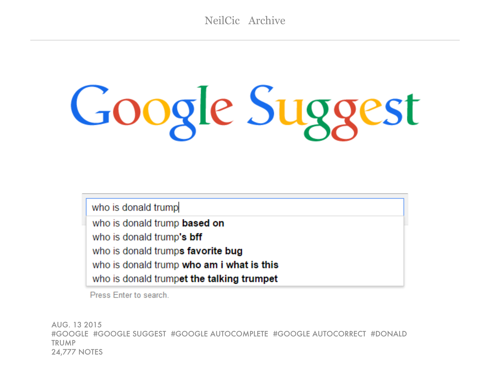

# AJAX

## 概述

### 背景

“JavaScript 对我们而已能力有限”，我们目前所了解到的 Web 所提供的 API 都只停留在“单机游戏”的阶段。

例如：

- 无法在实现用户登录功能时，当用户输入邮箱地址显示用户对应的头像
- 无法在实现用户注册功能时，当用户输入邮箱或者用户名就提示是否存在
- 无法在实现留言板功能时，实时看到最新的用户留言

> 思考：为什么做不到这些呢？


在此之前，我们可以通过以下几种方式让浏览器发出对服务端的请求，获得服务端的数据：

- 地址栏输入地址，回车，刷新
- 特定元素的 href 或 src 属性
- 表单提交

这些方案都是我们无法通过或者很难通过代码的方式进行编程（对服务端发出请求并且接受服务端返回的响应），**如果我们可以通过 JavaScript 直接发送网络请求，那么 Web 的可能就会更多，随之能够实现的功能也会更多，至少不再是只能开发“单机游戏”。**

> 对 XXX 进行编程指的就是用代码的方式操作它。

### Google Suggest

web 1.0   看到信息

web 2.0  和用户交互

AJAX（Asynchronous JavaScript and XML），最早出现在 2005 年的 [Google Suggest](http://google-suggest.tumblr.com/)，是在浏览器端进行网络编程（发送请求、接收响应）的技术方案，它使我们可以通过 JavaScript 直接获取服务端最新的内容而不必重新加载页面。让 Web 更能接近桌面应用的用户体验。



### AJAX (Asynchronous Javascript And XML)

说白了，**AJAX 就是浏览器提供的一套 API，可以通过 JavaScript 调用，从而实现通过代码控制请求与响应。实现通过 JavaScript 进行网络编程。**

至于 **XML**：最早在客户端与服务端之间传递数据时所采用的数据格式就是 XML。

> 能力不够 API 凑。

### 应用场景总结

对于每一个未知的技术，我们在了解了过后第一反应就是在什么情况下用？

- 按需获取数据
- 对用户数据校验
- 自动更新页面内容
- 提升用户体验，无刷新的体验

## 快速上手

AJAX API 中核心提供的是一个 `XMLHttpRequest` 类型，所有的 AJAX 操作都需要使用到这个类型。

使用 AJAX 的过程可以类比平常我们访问网页过程

```javascript
// 1. 创建一个 XMLHttpRequest 类型的对象 —— 相当于打开了一个浏览器
var xhr = new XMLHttpRequest()
// 2. 打开与一个网址之间的连接 —— 相当于在地址栏输入访问地址
xhr.open('GET', '/time')
// 3. 通过连接发送一次请求 —— 相当于回车或者点击访问发送请求
xhr.send(null)
// 4. 指定 xhr 状态变化事件处理函数 —— 相当于处理网页呈现后的操作
xhr.onreadystatechange = function () {
  // 通过 xhr 的 readyState 判断此次请求的响应是否接收完成
  if (this.readyState === 4) {
    // 通过 xhr 的 responseText 获取到响应的响应体
    console.log(this.responseText)
  }
}
```

> 注意：涉及到 AJAX 操作的页面不能使用文件协议访问（文件的方式访问）

### readyState

由于 `readystatechange` 事件是在 `xhr` 对象状态变化时触发（不单是在得到响应时），也就意味着这个事件会被触发多次，所以我们有必要了解每一个状态值代表的含义：

| readyState | 状态描述         | 说明                                                      |
| ---------- | ---------------- | --------------------------------------------------------- |
| 0          | UNSENT           | 代理（XHR）被创建，但尚未调用 `open()` 方法。             |
| 1          | OPENED           | `open()` 方法已经被调用，建立了连接。                     |
| 2          | HEADERS_RECEIVED | `send()` 方法已经被调用，并且已经可以获取状态行和响应头。 |
| 3          | LOADING          | 响应体下载中， `responseText` 属性可能已经包含部分数据。  |
| **4**      | DONE             | 响应体下载完成，可以直接使用 `responseText`。             |

#### 时间轴

```flow
s=>start: UNSENT
o1=>operation: OPENED
o2=>operation: HEADERS_RECEIVED
o3=>operation: LOADING
e=>end: DONE

s(right)->o1(right)->o2(right)->o3(right)->e
```

```flow
s=>start: 初始化
o1=>operation: 建立连接
o2=>operation: 接收到响应头
o3=>operation: 响应体加载中
e=>end: 加载完成

s(right)->o1(right)->o2(right)->o3(right)->e
```

```javascript
var xhr = new XMLHttpRequest()
console.log(xhr.readyState)
// => 0
// 初始化 请求代理对象

xhr.open('GET', '/time')
console.log(xhr.readyState)
// => 1
// open 方法已经调用，建立一个与服务端特定端口的连接

xhr.send()

xhr.addEventListener('readystatechange', function () {
  switch (this.readyState) {
    case 2:
      // => 2
      // 已经接受到了响应报文的响应头

      // 可以拿到头
      // console.log(this.getAllResponseHeaders())
      console.log(this.getResponseHeader('server'))
      // 但是还没有拿到体
      console.log(this.responseText)
      break

    case 3:
      // => 3
      // 正在下载响应报文的响应体，有可能响应体为空，也有可能不完整

      // 在这里处理响应体不保险（不可靠）
      console.log(this.responseText)
      break

    case 4:
      // => 4
      // 一切 OK （整个响应报文已经完整下载下来了）

      // 这里处理响应体
      console.log(this.responseText)
      break
  }
})
```

通过理解每一个状态值的含义得出一个结论：一般我们都是在 `readyState` 值为 `4` 时，执行响应的后续逻辑。

```javascript
xhr.onreadystatechange = function () {
  if (this.readyState === 4) {
    // 后续逻辑......
  }
}
```

### 遵循 HTTP

本质上 XMLHttpRequest 就是 JavaScript 在 Web 平台中发送 HTTP 请求的手段，所以我们发送出去的请求任然是 HTTP 请求，同样符合 HTTP 约定的格式：

```javascript
// 设置请求报文的请求行
xhr.open('GET', '/time')
// 设置请求头
xhr.setRequestHeader('Accept', 'text/plain')
// 设置请求体
xhr.send(null)

xhr.onreadystatechange = function () {
  if (this.readyState === 4) {
    // 获取响应状态码
    console.log(this.status)
    // 获取响应状态描述
    console.log(this.statusText)
    // 获取响应头信息
    console.log(this.getResponseHeader('Content-Type')) // 指定响应头
    console.log(this.getAllResponseHeaders()) // 全部响应头
    // 获取响应体
    console.log(this.responseText) // 文本形式
    console.log(this.responseXML) // XML 形式，了解即可不用了
  }
}
```

> 参考链接：
> - https://developer.mozilla.org/zh-CN/docs/Web/API/XMLHttpRequest
> - https://developer.mozilla.org/zh-CN/docs/Web/API/XMLHttpRequest/Using_XMLHttpRequest

## 具体用法

### GET 请求

> 通常在一次 GET 请求过程中，参数传递都是通过 URL 地址中的 `?` 参数传递。

```javascript
var xhr = new XMLHttpRequest()
// GET 请求传递参数通常使用的是问号传参
// 这里可以在请求地址后面加上参数，从而传递数据到服务端
xhr.open('GET', '/delete?id=1')
// 一般在 GET 请求时无需设置响应体，可以传 null 或者干脆不传
xhr.send(null)
xhr.onreadystatechange = function () {
  if (this.readyState === 4) {
    console.log(this.responseText)
  }
}

// 一般情况下 URL 传递的都是参数性质的数据，而 POST 一般都是业务数据
```

### POST 请求

> POST 请求过程中，都是采用请求体承载需要提交的数据。

```javascript
var xhr = new XMLHttpRequest()
// open 方法的第一个参数的作用就是设置请求的 method
xhr.open('POST', '/add')
// 设置请求头中的 Content-Type 为 application/x-www-form-urlencoded
// 标识此次请求的请求体格式为 urlencoded 以便于服务端接收数据
xhr.setRequestHeader('Content-Type', 'application/x-www-form-urlencoded')
// 需要提交到服务端的数据可以通过 send 方法的参数传递
// 格式：name=zhangsan&age=18
xhr.send('name=zhangsan&age=18')
xhr.onreadystatechange = function () {
  if (this.readyState === 4) {
    console.log(this.responseText)
  }
}
```

### 同步与异步

关于同步与异步的概念在生活中有很多常见的场景，举例说明。

> - 同步：一个人在同一个时刻只能做一件事情，在执行一些耗时的操作（不需要看管）不去做别的事，只是等待
> - 异步：在执行一些耗时的操作（不需要看管）去做别的事，而不是等待

`xhr.open()` 方法第三个参数要求传入的是一个 `bool` 值，其作用就是设置此次请求是否采用异步方式执行，默认为 `true`，如果需要同步执行可以通过传递 `false` 实现：

```javascript
console.log('before ajax')
var xhr = new XMLHttpRequest()
// 默认第三个参数为 true 意味着采用异步方式执行
xhr.open('GET', '/time', true)
xhr.send(null)
xhr.onreadystatechange = function () {
  if (this.readyState === 4) {
    // 这里的代码最后执行
    console.log('request done')
  }
}
console.log('after ajax')
```

如果采用同步方式执行，则代码会卡死在 `xhr.send()` 这一步：

```javascript
console.log('before ajax')
var xhr = new XMLHttpRequest()
// 同步方式
xhr.open('GET', '/time', false)
// // 同步方式 执行需要 先注册事件再调用 send，否则 readystatechange 无法触发
// xhr.onreadystatechange = function () {
//   if (this.readyState === 4) {
//     // 这里的代码最后执行
//     console.log('request done')
//   }
// }
xhr.send(null)
// 因为 send 方法执行完成 响应已经下载完成
console.log(xhr.responseText)
console.log('after ajax')
```

演示同步异步差异。

所以一定在发送请求 `send()` 之前注册 `readystatechange`（不管同步或者异步）

- 为了让这个事件可以更加可靠（一定触发），一定是先注册

> 了解同步模式即可，切记不要使用同步模式。

至此，我们已经大致了解了 AJAX 所的提供的基本 API 。

### XMLHttpRequest API 总结

#### 属性

- `readyState`
- `status`
- `responseText`
- `responseXml`
- `onreadystatechange`

#### 方法

- `open(method, url, async)`
- `send(requsetBody)`
