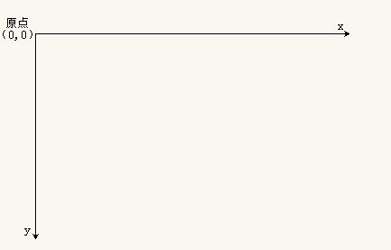

# 大纲

- flash（Adobe）Photoshop

## 初识canvas

> 通过程序的方式绘制图像

## canvas基本使用
- canvas坐标系
  - 坐标原点在画布的左上角
  - x轴水平向右
  - y轴垂直向下



- 绘图基本步骤

```javascript
// 获取canvas画布
var cas = document.getElementById('cas');
// 获取绘图工具
var ctx = cas.getContext('2d');
// 设置绘图起始位置
ctx.moveTo(10,10);
// 绘制路径
ctx.lineTo(100,100);
// 描边
ctx.stroke();
```

## 绘制图形
- 路径的概念（隐形墨水）
- 路径绘制方式(路径与隐形墨水)
    + 描边 stroke()
    + 填充 fill()
    + 既描边又填充 stroke() 和 fill()


- 手动闭合与closePath()闭合路径

- 非零环绕规则（闭合路径填充规则）


  
- beginPath() 开启新的路径

## 绘制图形样式设置

- 画笔的状态
    + lineWidth 线宽，默认1px
    + lineCap 线末端类型：(butt默认)、round、square 
    + lineJoin 相交线的拐点 miter(默认)、round、bevel
    + strokeStyle 线的颜色
    + fileStyle 填充颜色
    + setLineDash() 设置虚线
    + getLineDash() 获取虚线宽度集合
    + lineDashOffset 设置虚线偏移量（负值向右偏移）

## 实例练习
- 镂空的房子
- 绘制坐标点
- 绘制折线图

## 绘制矩形
- rect(x,y,w,h) 没有独立路径
  - 前两个参数是坐标
  - 后两个参数是宽和高
- strokeRect(x,y,w,h) 有独立路径，不影响别的绘制
- fillRect(x,y,w,h) 有独立路径，不影响别的绘制
- clearRect(x,y,w,h) 擦除矩形区域

## 绘制圆弧
- 弧度概念：360度==2π弧度
- arc()
    + x 圆心横坐标
    + y 圆心纵坐标
    + r 半径
    + startAngle 开始角度
    + endAngle 结束角度
    + anticlockwise 是否逆时针方向绘制（默认false表示顺时针；true表示逆时针）

## 绘制文本
- ctx.font = '微软雅黑' 设置字体
- strokeText()
- fillText(text,x,y,maxWidth)
    + text 要绘制的文本
    + x,y 文本绘制的坐标（文本左下角）
    + maxWidth 设置文本最大宽度，可选参数
- ctx.textAlign文本水平对齐方式，相对绘制坐标来说的
    + left
    + center
    + right
    + start 默认
    + end
    + direction属性css(rtl ltr) start和end于此相关
        - 如果是ltr,start和left表现一致
        - 如果是rtl,start和right表现一致
- ctx.textBaseline 设置基线（垂直对齐方式  ）
    + top 文本的基线处于文本的正上方，并且有一段距离
    + middle 文本的基线处于文本的正中间
    + bottom 文本的基线处于文本的证下发，并且有一段距离
    + hanging 文本的基线处于文本的正上方，并且和文本粘合
    + alphabetic 默认值，基线处于文本的下方，并且穿过文字
    + ideographic 和bottom相似，但是不一样
- measureText() 获取文本宽度obj.width

## 实例
- 绘制扇形
- 绘制圆角矩形
- 饼图

## 绘制图片
- drawImage()
    + 三个参数drawImage(img,x,y)
        - img 图片对象、canvas对象、video对象
        - x,y 图片绘制的左上角
    + 五个参数drawImage(img,x,y,w,h)
        - img 图片对象、canvas对象、video对象
        - x,y 图片绘制的左上角
        - w,h 图片绘制尺寸设置(图片缩放，不是截取)
    + 九个参数drawImage(img,x,y,w,h,x1,y1,w1,h1)
        - img 图片对象、canvas对象、video对象
        - x,y,w,h 图片中的一个矩形区域
        - x1,y1,w1,h1 画布中的一个矩形区域
## 序列帧动画
- 绘制精灵图
- 动起来
- 控制边界
- 键盘控制

## 坐标变换
- 平移 移动画布的原点
    + translate(x,y) 参数表示移动目标点的坐标
- 缩放
    + scale(x,y) 参数表示宽高的缩放比例
- 旋转
    + rotate(angle) 参数表示旋转角度


## 参考文档
- [MDN](https://developer.mozilla.org/zh-CN/docs/Web/API/CanvasRenderingContext2D#￧ﾻﾘ￥ﾈﾶ￧ﾟﾩ￥ﾽﾢ)
- [w3schook](http://www.w3school.com.cn/tags/html_ref_canvas.asp)


