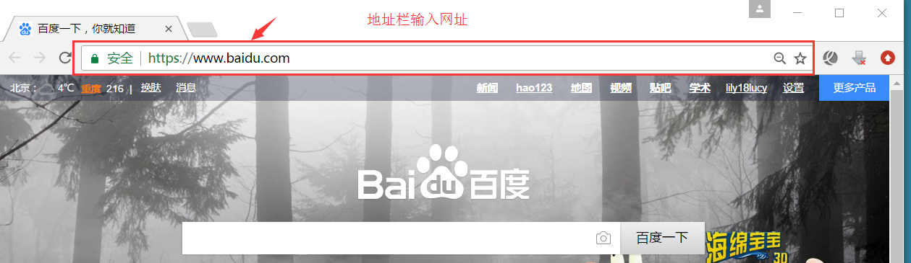

# 基础班学习目标

[[toc]]

#### 目标：

## 根据原型文件，能独立还原psd文件，转换符合W3C规范的网页。

网站首页


网站列表页


网页详情页


登录页 注册页等等。。。。


# 课程安排


 就业班详情 参看： http://www.itcast.cn/course/web.shtml 

# HTML 第一天目标

  能够写出基本的页面（里面包含图片、各种标签和链接）

# 1. 认识网页

```
网页主要由文字、图像和超链接等元素构成。当然，除了这些元素，网页中还可以包含音频、视频以及Flash等。
```


```
思考：  网页是如何形成的呢?
```


# 2. 浏览器（显示代码）

平时我们浏览网页，是在浏览器地址栏中输入网页地址，就可以访问我们的页面了。你的浏览器呢？



```
浏览器是网页显示、运行的平台，常用的浏览器有IE、火狐（Firefox）、谷歌（Chrome）、Safari和Opera等。我们平时称为五大浏览器。
```


可能你最熟悉的是 IE浏览器，但是。。。


## 查看浏览器占有的市场份额（知晓）

查看网站： <a href="http://tongji.baidu.com/data/browser" target="_blank">http://tongji.baidu.com/data/browser</a>


  2008年，大名鼎鼎的互联网巨头Google公司发布了它的首款浏览器Chrome浏览器。   

 跟王思聪一样，没办法，生下来人家就是富二代官二代啊，后台太强，而且确实先天能力得天独厚。 

 我的评价： 谷歌后台，唯我不败；一统江湖，千秋万代。

## 常见浏览器内核（理解）

首先解释一下浏览器内核是什么东西。英文叫做：Rendering Engine，中文翻译很多，排版引擎、解释引擎、渲染引擎，现在流行称为浏览器内核。

```
负责读取网页内容，整理讯息，计算网页的显示方式并显示页面.
```

1. Trident(IE内核)

​        代表： IE、傲游、世界之窗浏览器、Avant、腾讯TT、猎豹安全浏览器、360极速浏览器、百度浏览器等。

2. Gecko(firefox) 

​        可惜这几年已经没落了， 比如 打开速度慢、升级频繁、猪一样的队友flash、神一样的对手chrome。

3.  webkit(Safari)  

​         现在很多人错误地把 webkit 叫做 chrome内核（即使 chrome内核已经是 blink 了）。苹果感觉像被别人抢了媳妇，都哭晕再厕所里面了。

​       代表浏览器：傲游浏览器3

4.  Chromium/Blink(chrome) 

​        在 Chromium 项目中研发 Blink 渲染引擎（即浏览器核心），内置于 Chrome 浏览器之中。Blink 其实是 WebKit 的分支。 

​         大部分国产浏览器最新版都采用Blink内核。二次开发

5. Presto(Opera) 

​          Presto（已经废弃） 是挪威产浏览器 opera 的 "前任" 内核，为何说是 "前任"，因为最新的 opera 浏览器早已将之抛弃从而投入到了谷歌怀抱了。  现在用blink内核。


```
移动端的浏览器内核主要说的是系统内置浏览器的内核。

Android手机而言，使用率最高的就是Webkit内核，大部分国产浏览器宣称的自己的内核，基本上也是属于webkit二次开发。

iOS以及WP7平台上，由于系统原因，系统大部分自带浏览器内核，一般是Safari或者IE内核Trident的
```

# 3. Web标准（重点）

### 目标

* 记忆
  * 能说出网页 中 web 标准三层组成
* 理解
  * 能结合人来表述web标准三层

Web标准不是某一个标准，而是由W3C组织和其他标准化组织制定的一系列标准的集合。

W3C 万维网联盟 是国际最著名的标准化组织。1994年成立后，至今已发布近百项相关万维网的标准，对万维网发展做出了杰出的贡献。

**w3c就类似于现实世界中的联合国。**

## 3.1 为什么要遵循WEB标准呢？

 通过以上浏览器的内核不同，我们知道他们渲染或者排版的模式就有些许差异，显示就会有差别。

```
问：  哪个方言再全国基本都可以听得懂？      
```


## 3.2 Web 标准的好处

*1*、让Web的发展前景更广阔 
*2*、内容能被更广泛的设备访问
*3*、更容易被搜寻引擎搜索
*4*、降低网站流量费用
*5*、使网站更易于维护
*6*、提高页面浏览速度

专业的人做专业的事。  来呀~快活呀~反正有大把时间~

##  3.3 Web 标准构成

**构成：** 主要包括结构（Structure）、表现（Presentation）和行为（Behavior）三个方面。

* 结构标准：结构用于对网页元素进行整理和分类，咱们主要学的是HTML。 对于网页来说最重要的一部分


* 表现标准：表现用于设置网页元素的版式、颜色、大小等外观样式，主要指的是CSS
* 行为标准：行为是指网页模型的定义及交互的编写，咱们主要学的是 Javascript

 理想状态我们的源码： .HTML      .css      .js    

直观感受：


总结WEB标准：

结构标准：     决定你是否有个好天然身体 


表现标准：     决定你是否打扮的美丽外观


行为标准：     决定你是否有吸引人的行为


## 3.4 课堂一练：

**1.关于WEB标准下列说法正确的是: **

* [ ] html决定页面的行为，css决定页面的样式，js决定页面的结构

* [ ] html决定页面的样式，css决定页面的结构，js决定页面的行为

* [ ] html决定页面的结构，css决定页面的样式，js决定页面的行为

* [ ] 以上都不正确

2 **web 标准里边规定三层分离不包括哪部分**

* [ ] HTML

* [ ] CSS

* [ ] JavaScript

* [ ] PHP

3.**关于WEB标准下列说法正确的是**

* [ ] html相当于人的动作行为，CSS相当于人的穿着打扮，javascript相当于人的骨架结构；

* [ ] html相当于人的骨架结构，CSS相当于人的穿着打扮，javascript相当于人的动作行为；

* [ ] html相当于人的穿着打扮，CSS相当于人的骨架结构，javascript相当于人的动作行为；

* [ ] html相当于人的骨架结构，CSS相当于人的动作行为，javascript相当于人的穿着打扮；


# 4. @拓展

* **介绍一下你对浏览器内核的理解？常见的浏览器内核有哪些？**

  浏览器内核包括两部分，渲染引擎和js引擎。渲染引擎负责读取网页内容，整理讯息，计算网页的显示方式并显示页面，js引擎是解析执行js获取网页的动态效果。 后来 JS 引擎越来越独立，内核就倾向于只指渲染引擎。
  IE：Trident 
  firefox：Gecko 
  chrom、safari：webkit 
  Opera：Presto 最新的是 BLINK 
  Microsoft Edge：EdgeHTML

  深度阅读：[五大主流浏览器内核的源起以及国内各大浏览器内核总结](http://blog.csdn.net/summer_15/article/details/71249203) 