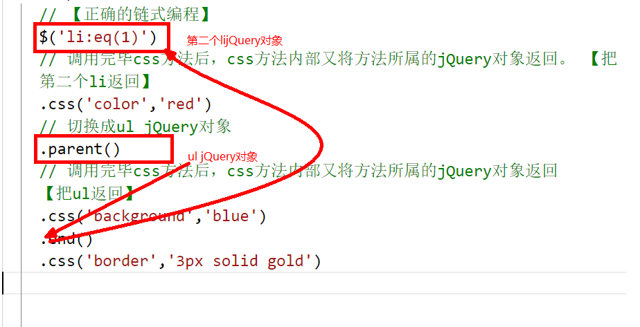

# jQuery-笔记5

## 核心知识点

+ 链式编程
+ 多库共存问题
+ jQuery插件的使用


## 一.链式编程

### 1.1 什么是链式编程

> ​	在jQuery中，若jQuery对象调用一些方法来做==设置==操作时 ，方法完毕后，内部会==重新返回当前的jQuery对象== ，所以可以继续调用jQuery对象的其他方法，这种现象就是链式编程。
>
> ​	注意：若jQuery对象调用一些方法来做==获取== 操作（内容、大小、位置等），方法完毕后，==内部返回的不是jQuery对象== ，所以无法再继续调用jQuery对象的其他方法。

```javascript
    // 【正确的链式编程】
    $('li:eq(1)')
    // 调用完毕css方法后，css方法内部又将方法所属的jQuery对象返回。 【把第二个li返回】
    .css('color','red')
    // 切换成ul jQuery对象
    .parent()
    // 调用完毕css方法后，css方法内部又将方法所属的jQuery对象返回    【把ul返回】
    .css('background','blue');

    // var r = $('li:eq(1)').css('color','red');
    // console.log(r instanceof jQuery);


    // 【错误的链式编程】
    $('li:eq(1)')
    .css('color','red')
    // text方法在这里是读取li中的内容，该方法返回的不是jQuery对象，而是字符串内容 '我是li2'
    .text() 
    // 报错，因为字符串不是jQuery对象，所以无法调用其他jQuery对象的方法
    .parent()
    .css('background','blue');

    // var v = $('li:eq(1)').css('color','red').text() ;
    // console.log(v instanceof jQuery);
```


### 1.2 end方法的使用

> end 方法，在链式上可以回到上一个jQuery对象



### 案例：

+ 案例1：五星评分


## 二.多库共存问题

> 问题：关于`$`冲突的问题 ？
>
> 解决方案：==jQuery.noConflict();==  释放 $,把的函数返回给用户，用户可以用其他变量接收
>
> ```javascript
>     // $('button').click(function(){
>     //   alert(1);
>     // });
>
>     // 解决方案1：jQuery中不使用$,使用jQuery
>     // jQuery('button').click(function(){
>     //   alert(1);
>     // });
>
>     // 解决方案2：jQuery库释放$符合的使用权，用其他简单的符号代替
>     // jQuery.noConflict(); 释放$,把$代表的函数返回给用户，用户可以用其他变量接收
>     var $1 = jQuery.noConflict();
>     $1('button').click(function(){
>       alert(1);
>     });
>
> ```


## 三.jQuery插件的使用

### 3.1 如何获取插件

​	百度搜索、github搜索

​	看技术文章

​	跟别人交流

​	jQuery插件库之家： http://www.htmleaf.com


### 3.2 如何使用插件

+ 找到并且下载插件
+ 在项目外写一个demo（先学会使用，让后再加入项目中）
+ 看源码，看文档

注意：

1. 复制结构，保证结构关系是一致的。标签名不一致无所谓
2. 样式，可以选择复制，也可以定义自己需要的样式
3. 先引入jQuery文件，再引入插件库文件，再去使用
4. 复制源代码或看文档使用


### 3.3 放大镜和轮播图插件

- 放大镜插件
  - [jQuery.zoom](http://www.jacklmoore.com/zoom/)
- 轮播图插件
  - [http://sorgalla.com/jcarousel/](http://sorgalla.com/jcarousel/)


### 案例

+ 案例1：使用放大镜插件
+ 案例2：使用轮播图插件


