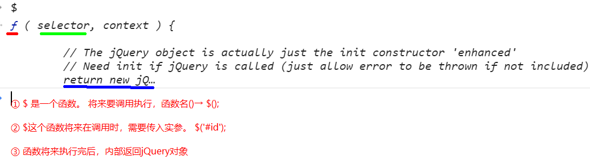

# jQuery-笔记1

## 核心知识点

+ jQuery的特点
+ jQuery对象和DOM对象的互相转换
+ 选择器
+ jQuery方式操作样式
+ jQuery方式注册事件


## 一.jQuery介绍

### 1.1 什么是jQuery

 **库**，本质就是**一个js文件**。

### 1.2 为什么要学习jQuery

比较流行。PC

### 1.3 jQuery的特点

+ **少写，多做**。 
+ 开源
+ 隐式迭代（遍历）
+ 丰富的插件
+ 自己写插件
+ 强大选择器
+ 链式编程


### 1.4 jQuery的版本

+ 1.x
  + 兼容IE低版本
    + 压缩版：项目上线使用
    + 未压缩版：开发中使用
+ 2.x
  + 不兼容IE低版本
+ 3.x
  + 精简版

**官网：http://jquery.com**

**下载地址：https://code.jquery.com/jquery/**


### 1.5 使用jQuery

> 一定要==引入jQuery文件== 
>
> ```html
> <script src="jquery文件路径"></script>
> ```


## 二.jQuery对象和DOM对象

### 2.1 DOM对象

> 在webAPI中，通过所有获取元素的方式获取的元素都是 DOM对象

### 2.2 jQuery对象

+ **认识$符号** 

  > 

  ​

+ **创建jQuery对象** 

  > + ==$('选择器');==      返回jQuery对象
  >
  > + jQuery('选择器');  返回jQuery对象
  >
  > + 代码：
  >
  >   ```html
  >     <div id="box"></div>
  >     <script src="lib/jquery-1.12.4.js"></script>
  >     <script>
  >       var $box = $('#box');     //推荐使用的方式
  >       console.log($box);
  >       var $box = jQuery('#box');
  >       console.log($box);
  >
  >       // 因为$ 和 jQuery两个符号指的是同一个东西。
  >       console.log($===jQuery);    // true
  >       // 检测$box对象是否属于jQuery
  >       console.log($box instanceof jQuery);  //true
  >     </script>
  >   ```
  >
  >   ​

+ **jQuery对象的本质** 

  > 通过$符号调用所返回的jQuery对象的**本质就是一个集合**（==伪数组==）→ jQuery对象
  >
  > ```html
  >   <button id="btn">按钮</button>
  >   <ul>
  >     <li>我是li1</li>
  >     <li>我是li2</li>
  >     <li>我是li3</li>
  >   </ul>
  >   <script src="lib/jquery-1.12.4.js"></script>
  >   <script>
  >     // 获取按钮对应的jQuery对象
  >     var $btn = $('#btn');
  >     // 后期多个li对应的jQuery对象
  >     var $lis = $('li');
  >
  >     console.log($btn); // jQuery.fn.init [button#btn]
  >     console.log($lis); // jQuery.fn.init(3) [li, li, li]
  >
  >     // 通过$符号调用所返回的jQuery对象的本质就是一个集合（伪数组）→ jQuery包
  >     
  >     // jQuery包中通过中括号取出的具体的某一个不属于jQuery对象
  >     console.log($lis[0] instanceof jQuery);
  >     // jQuery包这个整体才是属于jQuery对象
  >     console.log($lis instanceof jQuery);
  >   </script>
  > ```

  ​


### 2.3 jQuery对象和DOM对象的区别

+ jQuery对象只能使用jQuery对象中提供的属性或方法，不能够使用DOM对象中提供的属性或方法
+ DOM对象只能使用DOM对象中提供的属性或方法，不能使用jQuery对象中提供的属性或方法


### 2.4 DOM对象转jQuery对象

+ 语法： ==$(dom对象);==

+ 代码：

  ```html
    <div></div>
    <script src="lib/jquery-1.12.4.js"></script>
    <script>
      // 【DOM对象  转  jQuery对象】
      var div = document.querySelector('div');
      // 转换
      var $div = $(div);
      $div.css({
        width:500,
        height:500,
        border:'1px solid'
      });
     </script>
  ```

### 2.5 jQuery对象转DOM对象

+ 语法：jQuery对象[索引];   本质就是从伪数组中取出指定的dom对象

+ 代码：

  ```html
  <div></div>
  <script>
  	// jQuery对象转DOM对象
  	var div = $('div')[0];
  	div.innerText = '我是文本'
  </script>
  ```


## 三. jQuery注册事件

+ 语法：==$('选择器'). 事件名(事件处理程序);== 

+ 代码：

  ```html
    <button>点击</button>
    <script src="lib/jquery-1.12.4.js"></script>
    <script>
     $('button').click(function(){
       alert('nihao')
     });
      
    </script>
  ```


## 四.jQuery操作样式

### 3.1 设置样式

+ 设置单个样式： jQuery对象.css(name,value);

+ 设置多个样式：

  > jQuery对象.css({
  >
  > ​	name:value,
  >
  > ​	name:value,
  >
  > ​	name:value,
  >
  > ​	name:value
  >
  > });

+ 代码：

  ```html
    <div>我是文字</div>
    <script src="lib/jquery-1.12.4.js"></script>
    <script>
      // 设置单个样式
      $('div').css('width',500);
      $('div').css('height',500);
      $('div').css('background','red');

      // 设置多个样式
      $('div').css({
        border:'10px solid blue',
        background:'pink',
        color:'green'
      });
    
    </script>
  ```

### 3.2 获取样式值

+ 语法： jQuery对象.css('样式属性名');

+ 代码：

  ```html
    <style>
      div {
        width: 300px;
        height: 300px;
        position:absolute;
        background-color: red;
        left:200px;
        top:100px;
      }
    </style>
    <div></div>
    <script src="lib/jquery-1.12.4.js"></script>
    <script>
      var h = $('div').css('height');
      var l = $('div').css('left');
      console.log(h);
      console.log(l);
    </script>
  ```


## 五. 通过选择器获取jQuery对象

### 7.2 基本选择器

| 名称    | 用法                | 描述                     |
| ----- | ----------------- | :--------------------- |
| ID选择器 | $('#id')          | 获取指定ID的元素              |
| 类选择器  | $('.class')       | 获取同一类class的元素          |
| 标签选择器 | $('div')          | 获取同一类标签的所有元素           |
| 并集选择器 | $('div,p,li')     | 使用逗号分隔，只要符合条件之一就可。     |
| 交集选择器 | $('div.redClass') | 获取class为redClass的div元素 |


### 7.2 层级选择器

| 名称    | 用法           | 描述                              |
| ----- | ------------ | :------------------------------ |
| 子代选择器 | $('ul > li') | 使用>号，获取儿子层级的元素，注意，并不会获取孙子层级的元素  |
| 后代选择器 | $('ul li')   | 使用空格，代表后代选择器，获取ul下的所有li元素，包括孙子等 |


### 7.3 过滤器选择器

- 这类选择器都带冒号:

| 名称         | 用法                                | 描述                                     |
| ---------- | --------------------------------- | :------------------------------------- |
| :eq(index) | $('li:eq(2)').css('color', 'red') | 获取到的li元素中，选择索引号为2的元素，索引号index**从0开始。** |
| :odd       | $('li:odd').css('color', 'red')   | 获取到的li元素中，选择索引号为奇数的元素                  |
| :even      | $('li:even').css('color', 'red')  | 获取到的li元素中，选择索引号为偶数的元素                  |

案例：隔行变色


### 7.4 选择器筛选方法

- 筛选选择器的功能与过滤选择器有点类似，但是用法不一样，筛选选择器主要是方法。

| 名称                 | 用法                         | 描述                         |
| ------------------ | -------------------------- | :------------------------- |
| children(selector) | \$('ul').children('li')    | 相当于\$('ull > i')，子类选择器     |
| find(selector)     | \$('ul').find('li')        | 相当于\$('ul li'),后代选择器       |
| siblings(selector) | $('#first').siblings('li') | 查找兄弟节点，不包括自己本身。            |
| parent()           | $('#first').parent()       | 查找父亲                       |
| eq(index)          | $('li').eq(2)              | 相当于$('li:eq(2)'),index从0开始 |
| next()             | $('li').next()             | 找下一个兄弟                     |
| prev()             | $('li').prev()             | 找上一次兄弟                     |


案例：下拉菜单

案例：手风琴

案例：淘宝精品


## 今日扩展

### 扩展1：jQuery中的入口函数

+ 原生的window.onload

+ jQuery中的入口函数

  + 语法1：

    > $(function(){
    >
    > ​	// 获取元素
    >
    > });

  + 语法2:

    > $(document).ready(function(){
    >
    > ​	// 获取元素
    >
    > });

+ 区别：

  ```html
    <script>
      // onload事件，指的是当页面中所有资源【DOM树、其他外联资源】加载完毕后，才会执行
      window.onload = function(){
        console.log(1);  // 后执行
      };
      // 仅仅等DOM树加载完毕后会执行。
      $(function(){
        console.log(2);  // 先执行
        console.log($('button'));
      });
    </script>
  ```


