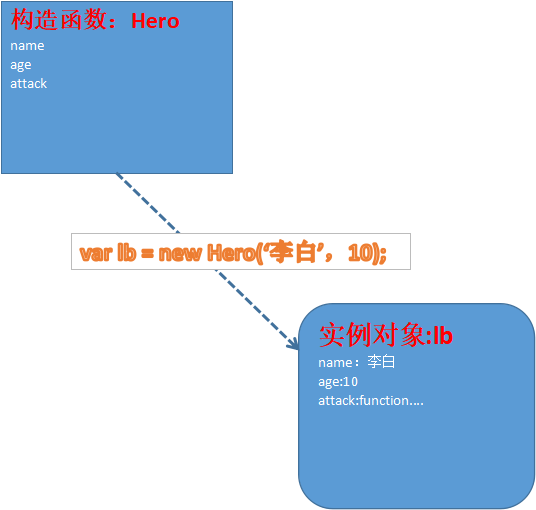
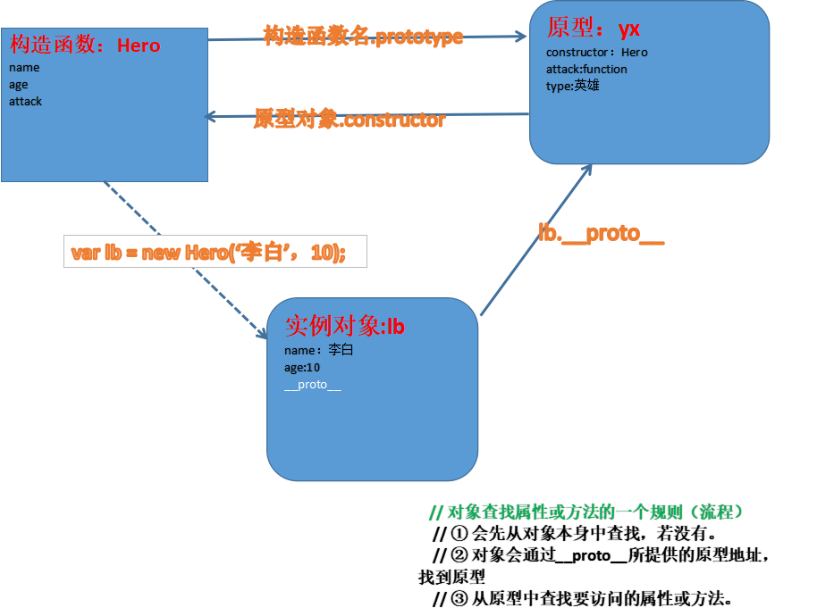

# JS高级-day01

## 核心知识点

+ 面向过程和面向对象的区别
+ 原型
+ 构造函数、原型和实例的关系


## 一.  高级要学什么？

+ 理解面向对象开发思想（理论、实战→贪吃蛇游戏）
+ 了解 JavaScript 面向对象开发相关模式
+ 掌握 JavaScript 的高级语法（递归、闭包、函数作为函数的参数、函数作为函数的返回值、this）
+ 掌握在 JavaScript 中使用正则表达式（表单验证）


## 二. 面向过程和面向对象

### 2.1 区别

+ 面向过程：关注的是**过程** 中的每一个环节
  + 吃蛋炒饭：买鸡蛋→买米→蒸米→炒蛋→炒米→混合→搅拌→蛋炒饭
+ 面向对象：关注的是让**对象** 做事情
  + 找一个对象（老公或老婆）.做蛋炒饭


### 2.2 面向对象编程

> ​	Object Oriented Programming，简称 OOP ，是一种**编程开发思想** 。它将**真实世界各种复杂的关系** ，**抽象为一个个对象** ，然后由**对象之间**的**分工**与**合作**，完成对真实世界的模拟。 
>
> // ① 现实需求（盖大楼）
>
> // ② 需要哪些对象（设计师、搬运工、砌墙师、木匠、导购.....）
>
> // ③ 分工与合作
>
> // ④ 完成项目


### 2.3 面向对象的好处

+ 易于分工与合作，适合大型项目的开发。
+ 健壮性强，==易于维护==。


### 2.3 面向对象的特征

+ 封装:对象把实现过程封装在方法中，调用者只需要调用即可。而不需要了解过程。
+ 继承：子承父业。 对象b可以继承对象a中的属性和方法。可以减少代码冗余
+ [多态]：一种事物（动物），可以具有多种表现形式（鸭、狗、猫.....）。


面向对象不是替代面向过程，而是面向过程的更高一级的封装。


## 三. 构造函数和实例

类和实例 或 类和对象

构造函数 和 实例

+ 类：（狗，抽象的）
  + 传统的编程语言：java、C# → class
  + ES3.0 和 ES5.0 没有类的概念   ECMAScript → ES
    + 构造函数模拟类
  + ES6.0 有类概念→ class
+ 实例（对象）：（食堂门口的一条中华田园犬，具体存在的）
+ 类和实例关系：类是实例的模板，实例是类的一个具体的实现。
+ 创建对象：==new==  类名();    
+ ES3.0 和 ES5.0 ： ==new==  构造函数名();
+ 构造函数：
  + 内置的构造函数：Object、Date、Array
  + 自己定义的：Dog、Cat、Hero


### 3.1  自定义构造函数创建对象

+ 自定义构造函数的语法：

  > function 构造函数名(形参...){
  >
  > ​	this.key = value;
  >
  > ​	this.key = value;
  >
  > }
+ 创建对象：new 构造函数(实参...);

### 3.2 new 关键字的作用

> 1. 在内存中申请了一块空间，存放了一个对象。（看不见）
> 2. 让构造函数内部的this指向该空间（看不见）
> 3. 通过this向内存中空的对象中添加属性和方法（看的见）
> 4. new关键字最后将this返回给外部变量（看不见）


### 3.3 构造函数和实例对象的关系

+ 构造函数：构造函数是对象的模板。
+ 实例对象：具体存在的，对象是类的一个实例。
 


### 3.4 构造函数和普通函数的区别

+ 相同：
  + 都是函数
+ 不同：
  + 命名规范：
    + 构造函数：帕斯卡
    + 普通函数：驼峰
  + 调用方式：
    + 构造函数： ==new==  构造函数();
    + 普通函数：普通函数();


### 课堂练习

1. 自定义英雄类型的构造函数，并且创建三个英雄对象（属性：姓名、年龄、性别；方法：攻击）。


## 四. 认识原型

### 4.1 为什么要学习原型

> 思考？之前创建对象存在的问题？
>


### 4.2  什么是原型

+ 原型介绍：也是一个对象，原型对象。
+ 获取原型的方式：==构造函数名.prototype== 
+ 构造函数和原型的关系:

  + 构造函数可以通过prototype找到原型

  + 原型可以通过constructor找到构造函数

  + 代码：

    > ```javascript
    >     // 定义构造函数→ 模板→类
    >     function Hero(name,age) {
    >       // 属性
    >       this.name = name;
    >       this.age = age;
    >       // 方法
    >       this.attack = function() {
    >         console.log(this.name +'正zai攻击....');
    >       };
    >     };
    >
    >     // 获取原型
    >     var yx = Hero.prototype;
    >     console.log(yx);
    >     // 原型对象中的constructor属性关联的是对应的构造函数
    >     console.log(yx.constructor === Hero);  // true
    > ```

    ​


### 4.3 原型的作用

> ​	
> ​	原型中定义的属性或方法，可以被所关联的构造函数所创建的实例对象==共享==。 减少了属性或方法的在内存占的使用，节省了内存空间。
>
> ```javascript
>     // 定义构造函数→ 模板→类
>     function Hero(name, age) {
>       // 属性
>       this.name = name;
>       this.age = age;
>       // this.type = '英雄';
>
>     };
>
>     // 获取原型
>     var yx = Hero.prototype;
>     // 向原型中添加一个方法attack
>     yx.attack = function () {
>       console.log(this.name + '正zai攻击....');
>     };
>     yx.type = '英雄';
>
>     var lb = new Hero('李白', 10);
>     var hy = new Hero('后裔', 11);
>     var blsy = new Hero('百里守约', 13);
>     console.log(lb,hy,blsy);
> ```
>
> 
>


### 4.4 构造函数、实对象和原型的关系




### 4.4 原型链

+ 属性或方法的查找规则


### 课堂一练

1. 用自定义构造函数 + 原型的方式创建英雄对象
2. 为内置对象数组扩展getSum方法