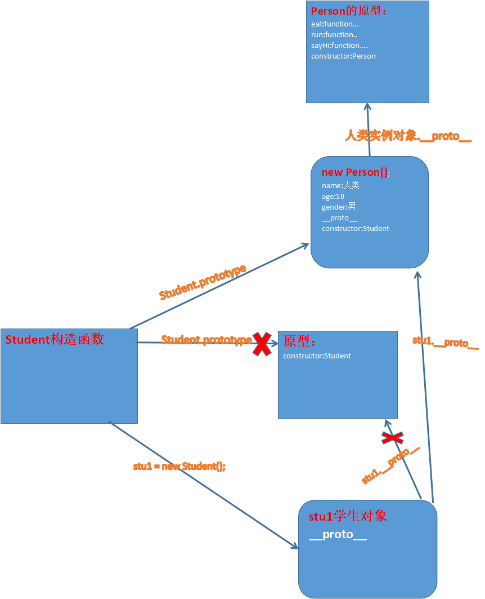
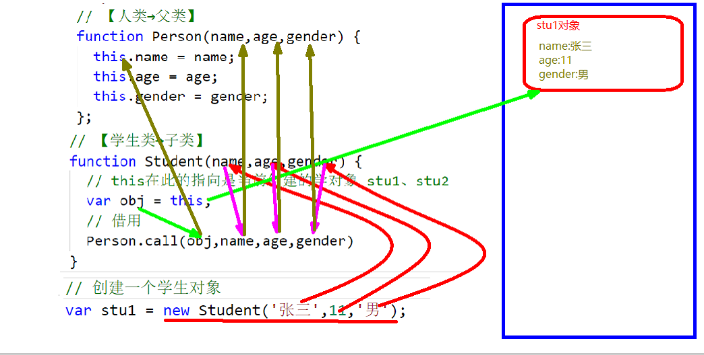

#  js高级-继承

## 核心知识点

+ 原型继承
+ 借用继承
+ 组合继承


## 一. 继承介绍

### 1.1 什么继承

+ 生活角度：子承父业。 

+ 编程：继承时类（子类）与类（父类）之间的关系。

  > + 没有用继承
  >   - 学生类（属性：姓名，年龄，性别  方法：吃，跑，打招呼）
  >   - 医生类（属性：姓名，年龄，性别  方法：吃，跑，打招呼）
  >   - 老师类（属性：姓名，年龄，性别  方法：吃，跑，打招呼）
  > + 使用继承
  >   + 人类（属性：姓名，年龄，性别  方法：吃，跑，打招呼）
  >   + 医生类→ 继承于→人类
  >   + 学生类→ 继承于→人类
  >   + 老师类→ 继承于→人类

### 1.2 继承的作用

+ 减少代码冗余（简化代码）


## 二 利用原型实现继承

+ 实现原型继承本质：更改子类的原型的指向，指向一个父类所创建的对象。 

  > 注意：更改了子类的原型指向后。 要补加一个constructor属性指向子类（构造函数）


+ 代码

  > ```javascript
  >     // 【人类→父类】
  >     function Person() {
  >       this.name = '人类';
  >       this.age = 10;
  >       this.gender = '男';
  >     };  
  >     Person.prototype.eat = function() {
  >       console.log('我会吃....');
  >     };
  >     Person.prototype.run = function() {
  >       console.log('我会跑....');
  >     };
  >     Person.prototype.sayHi = function() {
  >       console.log('你好.');
  >     };
  >
  >     // 【学生类→子类】
  >     function Student() {
  >     
  >     }
  >     // 原型继承-更改子类原型的指向一个父类对象
  >     Student.prototype = new Person();
  >     // 给重写后的原型补加一个contructor属性
  >     Student.prototype.contructor = Student;
  >
  >     // // 创建一个学生对象
  >     var stu1 = new Student();
  >     stu1.eat();
  > ```

+ 图解：



+ 优缺点：

  > + 优点：可以完美继承方法
  > + 缺点：继承的属性是没有意义的。


## 三. 借用继承

### 3.1 call方法改变this的指向

+ 语法：`函数名.call(调用者,实参,实参);   `  
+ 作用：该函数会在此立即执行，并且函数内部的this会指向参数中所写的调用者。

### 3.2 用call方法实现借用

+ 实现借用继承的本质：借用继承本质，更改父类构造函数中this的指向，指向当前所创建的子类对象


+ 代码：

  > ```javascript
  >     // 【人类→父类】
  >     function Person(name,age,gender) {
  >       this.name = name;
  >       this.age = age;
  >       this.gender = gender;
  >     };  
  >     Person.prototype.eat = function() {
  >       console.log('我会吃....');
  >     };
  >     Person.prototype.run = function() {
  >       console.log('我会跑....');
  >     };
  >     Person.prototype.sayHi = function() {
  >       console.log('你好.');
  >     };
  >
  >     // 【学生类→子类】
  >     function Student(name,age,gender) {
  >       // this在此的指向是当前创建的学对象 stu1、stu2
  >       var obj = this;
  >       // 借用
  >       Person.call(obj,name,age,gender);
  >     }
  >
  >     // 创建一个学生对象
  >     var stu1 = new Student('张三',11,'男');
  >     var stu2 = new Student('李四',12,'女');
  >
  >     // 总结：借用继承本质，更改父类构造函数中this的指向，指向当前所创建的学生对象
  >     // 优点：可以完美的借用属性
  >     // 缺点：方法无法借用。
  >
  > ```

+ 图解：



+ 优缺点：

  > + 优点：完美继承属性
  > + 缺点：无法继承方法。


## 四. 组合继承

### 4.1 原型+借用组合继承

+ 代码


