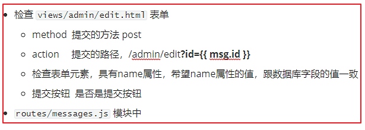

#  服务端编程Node.js

## 综合案例 ##

实现对留言的数据管理--增删改查

### 搭建项目 ###

- 初始化 package.json

  ```bash
  # 新建项目文件夹，guestbook
  npm init -y
  ```

- 安装使用到的第三方包

  - express
  - body-parser
  - mysql
  - art-template
  - express-art-template

- 项目结构

  设置静态资源，设置静态模板

  ```
  
  ├── package.json			
  ├── routes					存储路由模块
  ├── statics					存储静态资源
  │   ├── css
  │   ├── fonts
  │   ├── images
  │   └── js
  ├── views						存储模板
  │   ├── admin
  │   └── login.html
  ├── app.js					程序的入口文件
  └── db.js						操作数据库的模块
  ```

### 入口文件 ###

- 导入第三方模块

  ```bash

  const express = require('express');
  const bodyParser = require('body-parser');
  const expressTPL = require('express-art-template');
  
  ```

- 配置第三方模块

  ```js
  // 1. 配置静态资源
  app.use('/admin', express.static(path.join(__dirname, 'statics')));
  app.use('/', express.static(path.join(__dirname, 'statics')));
  // 2. 配置body-parser 解析请求体
  // parse application/x-www-form-urlencoded
  app.use(bodyParser.urlencoded({ extended: false }));
  // 3. 配置 express 模板引擎
  app.set('view engine', 'html');
  app.engine('html', expressTPL);
  ```

### 配置路由 ###

| 请求方法 | 路径          | 功能                     |
| -------- | ------------- | ------------------------ |
| get      | /admin        | 后台首页-留言列表        |
| get      | /admin/add    | 返回添加页面             |
| get      | /admin/edit   | 返回编辑页面             |
| get      | /login        | 返回登录页面             |
| get      | /             | 返回前台首页             |
| get      | /admin/delete | 实现删除功能，需要参数id |
| post     | /admin/add    | 实现添加功能             |
| post     | /admin/edit   | 实现编辑功能             |
| post     | /login        | 实现登录功能             |
| get      | /logout       | 实现退出功能             |

- 路由地址非常多，所以要放到不同的模块中处理(routes)。

- 可以把路由分为三类：后台管理、登录相关、前台功能。

- routes **文件夹中创建三个模块**

  ```
  └── routes
      ├── messages.js    后台数据管理的路由
      ├── users.js			 登录退出的路由
      └── index.js			 前台功能的路由
  ```

- 实现页面的展示功能，```js routes/messgaes.js ``` 中

  ```js
  const express = require('express');
  const router = module.exports = express.Router();
  router.get('/', (req, res) => {
    res.render('admin/index', {
    });
  });
  // 其它省略
  ```

- 注册路由模块，```js app.js ```

  ```js
  const msgRouter = require('./routes/messages');
  app.use('/admin', msgRouter);
  ```

- 静态资源路径的问题
  - 访问 http://127.0.0.1:3000/admin    --- index.html(静态资源相对路径)  css/main.css
    - 此时静态资源  http://127.0.0.1:3000/css/main.css
  - 访问 http://127.0.0.1:3000/admin/   --- index.html(静态资源相对路径)  css/main.css
    - 此时静态资源 http://127.0.0.1:3000/admin/css/main.css
  - 解决问题：
    - 在 index.html 中设置静态资源的路径，根路径  /css/main.css
    - 根路径： http://127.0.0.1:3000
  - 路径
    - 文件系统中的路径：建议使用绝对路径
    - URL 路径：网页中连接外部文件建议使用 根路径 (/)

### 模板继承 ###

- 后台列表页面、添加页面、编辑页面中大部分内容都是相同的
- 可以把相同的部分提取到一个 `layout.html`  文件中，让所有子页面继承 `layout.html`
- **让页面中重复的内容不再重复**

#### 提取 `layout.html` ####

```
├── views						存储模板
    ├── admin
    │		├── _layout					约定的文件夹名字，存储父模板
    │   │   └── layout.html
    │   ├── index.html
    │   ├── add.html
    │   ├── edit.html
    └── login.html
```

#### layout.html 中挖坑 ####

```html
<h1 class="page-header">{{ block 'title' }}{{ /block }}</h1>

{{ block 'content' }}{{ /block }}
```

#### 其它页面中填坑 ####

```html
<!-- 导入父模板 -->
{{ extend './_layout/layout.html' }}
<!-- 填充父模板 title 的位置 -->
{{ block 'title' }}
留言管理
{{ /block }}
<!-- 填充父模板 content 的位置 -->
{{ block 'content' }}
.....填充的内容
{{ /block }}
```

### 功能实现 ###

#### 准备 `db.js` 数据库操作模块 ####

#### 后台管理-留言列表 ####

- 准备工作，引入 `db.js` 模块

- 注册路由， `routes/messages.js` 模块中

- 操作数据库，查询所有留言

- 渲染模板

  ```js
  // routes/messages.js
  // 注册路由
  router.get('/', (req, res) => {
    // 查询所有留言
    db.query('select * from messages', (err, results) => {
      if (err) throw err;
      // 渲染模板，传入数据
      res.render('admin/index', {
        msgs: results
      });
    });
  });
  ```

- 设置模板，`views/admin/index.html` 中

     ```html
     {{ each msgs }}
     <tr>
       <td>{{ $index + 1 }}</td>
       <td>{{ $value.name }}</td>
       <td>
         
       </td>
       <td>
         {{ $value.time | dateFormat 'YYYY-MM-DD HH:mm:ss' }}
       </td>
       <td>
         <a href="/edit?id={{ $value.id }}" class="btn btn-xs btn-info">更新</a>
         <a href="/delete?id={{ $value.id }}" onclick="return confirm('确山删除？')" class="btn btn-xs btn-danger">删除</a>
       </td>
     </tr>
     {{ /each }}
     ```

- 细节处理-日期格式的展示

  - moment.js

  - 使用模板引擎 art-template 中的**过滤器**

    **过滤器的作用**：对模板中的数据进行格式化

    ```js
    // routes/messages.js
    const moment = require('moment');
    const template = require('art-template');
    // 给 art-template 设置过滤器
    template.defaults.imports.dateFormat = function(date, format){
      return moment(date).format(format);
    };
    
    // 在模板中调用 {{ $value.time | dateFormat 'YYYY-MM-DD HH:mm:ss' }}
    ```

#### 后台管理-删除留言 ####

- 在模板中设置删除按钮的地址，设置查询字符串

  - 通过 url 传递，留言信息的唯一标示 `id`

  - 点击删除按钮提示是否删除

  - `views/admin/index.html`中

    ```html
    <!-- 通过 url 传递id -->
    <!-- 点击删除按钮，提示是否删除 -->
    <a href="/admin/delete?id={{ $value.id }}" onclick="return confirm('确山删除？')" class="btn btn-xs btn-danger">删除</a>
    ```

- 注册路由，在 `routes/messages.js` 模块中

- 获取 `url` 中的查询字符串，参数 `id`

  - req.query  

- 数据库操作 - 删除

- 删除成功后，提示并跳转

  ```js
  // routes/messages.js
  // 删除数据
  // 注册路由
  router.get('/delete', (req, res) => {
    // 获取查询字符串参数 id
    let id = req.query.id;
    // TODO 判断id是否为数字
    // 执行数据库操作 - 删除
    db.query('delete from messages where id=?', id, (err, results) => {
      if (err) throw err;
      // 判断成功还是失败
      if (results.affectedRows > 0) {
        res.send('<script>alert("删除成功");location.href="/admin";</script>');
      } else {
        res.send('<script>alert("删除失败");location.href="/admin";</script>');
      }
    });
  });
  ```

#### 后台管理-添加留言 ####

- 设置 `views/admin/add` 模板中的表单
  - method ： post
  - action：/admin/add
  - 检查表单元素，name属性，建议和字段的名字一样
- 注册路由，`routes/messages.js` 模块中

- 构建消息对象（接收post的请求体）

- 执行数据库操作--添加

- 判断添加是否成功

- 提示并跳转

  ```js
  // routes/messages.js
  // 添加留言
  router.post('/add', (req, res) => {
    // 构造对象，添加到数据库
    let msg = {
      name: req.body.name,
      content: req.body.content,
      // time 数据库自动生成
      img: 'images/timg.jpg',
    };
    db.query('insert into messages set ?', msg, (err, results) => {
      if (err) throw err;
      if (results.affectedRows > 0) {
        res.send('<script>alert("添加成功");location.href="/";</script>');
      } else {
        res.send('<script>alert("添加成功");location.href="/add";</script>');
      }
    });
  });
  ```

#### 后台管理-编辑留言 ####

##### 显示编辑信息 #####

- 点击编辑按钮，跳转到编辑页面，展示要编辑的信息

  - 通过 url 传递，留言信息的唯一标示 `id`

  - `views/admin/index.html`中

    ```html
    <a href="/admin/edit?id={{ $value.id }}" class="btn btn-xs btn-info">更新</a>
    ```

  - 修改编辑的模板，展示编辑信息 `views/admin/edit.html` 中

    ```html
    <!-- 文本框中绑定信息 -->
    <input type="text" class="form-control" id="name" name="name" placeholder="用户名" value="{{ msg.name }}">
    <!-- 省略其它 -->
    ```

- 在服务器上获取信息，渲染模板

  - `routes/messages.js` 模块中

  - 注册路由

  - 接收通过查询字符串传递的 `id`

  - 数据库操作--根据 `id` 查询留言信息

  - 判断是否查询到结果

  - 渲染模板

    ```js

    // routes/messages.js
    router.get('/edit', (req, res) => {
      let id = req.query.id;
      // TODO 判断id是否是数字
      db.query('select * from messages where id=?', id, (err, results) => {
        if (err) throw err;
        if (results.length > 0) {
          res.render('admin/edit', {
            msg: results[0]
          })
        } else {
          res.send('<script>alert("没有获取到数据");location.href="/admin";</script>');
        }
      });
    });
    
    ```

##### 实现编辑功能 #####

- 检查 `views/admin/edit.html` 表单
  - method  提交的方法 post

  - action 提交的路径，`` /admin/edit?id={{ `msg.id` }} ``  (msg.id 用双大括号包裹起来 )

  - 检查表单元素，具有name属性，希望name属性的值，跟数据库字段的值一致

  - 提交按钮  是否是提交按钮

- `routes/messages.js` 模块中



- 注册路由

- 接收通过查询字符串传递的 `id`

- 接收 post 过来的请求体

- 构造 sql 语句，和对应的参数

- 数据库操作--更新留言

- 判断是否操作是否成功

- 提示并跳转

  ```js
  // routes/messages.js
  router.post('/edit', (req, res) => {
    let id = req.query.id;
    let sql = 'update messages set name=?, content=?, time=?, img=? where id=?';
    let params = [req.body.name, req.body.content, req.body.time, req.body.img, id];
    db.query(sql, params, (err, results) => {
      if (err) throw err;
      if (results.affectedRows > 0) {
        res.send('<script>alert("修改成功"); location.href="/";</script>');
      } else {
        res.send(`<script>alert("修改失败"); location.href="/edit?id=${id}";</script>`);
      }
    })
  });
  ```

## 中间件(middleware) express ##

为了理解中间件，我们先来看一下我们现实生活中的自来水厂的净水流程。


- 在上图中，自来水厂从获取水源到净化处理交给用户，中间经历了一系列的处理环节
- 我们称其中的每一个处理环节就是一个中间件。
- 这样做的目的既提高了生产效率也保证了可维护性。

### 什么是中间件 ###

- 中间件是 Express 的最大特色，也是最重要的一个设计
- 一个 Express 应用，就是由许许多多的中间件来完成的
- 中间件函数是能够访问请求对象、响应对象，以及应用程序的请求/响应循环中的下一个中间件函数
- 中间件函数可以执行以下任何任务
  - 执行任何代码
  - 修改 request 或者 response 响应对象
  - 结束请求响应周期
  - 调用下一个中间件

### 中间件分类 ###

- 内置中间件

  - express.static()

- 第三方中间件

  - body-parser

- 应用程序级别中间件

  - 所有请求中打印日志

    ```js
    // 在注册路由之前
    app.use((req, res, next) => {
      console.log(req.path);
      console.log('打印日志');
      next(); // 进入下一个路由处理
    });
    ```

  - 处理 404

    ```js
    // 在注册路由之后
    app.use((req, res, next) => {
      res.status(404);
      res.send('这是一个漂亮的404页面');
    });
    ```

- 路由级别中间件

- 错误处理中间件

  - 全局处理错误

    ```js
    // 在注册路由之后
    app.use(function (err, req, res, next) {
      console.error(err.stack)
      res.status(500).send('Something broke!')
    });
    ```


## 会话保持 ##

HTTP 协议是无状态的，服务端不能跟踪客户端的状态，也就无法记录客户端登录的状态。

### Cookie ###

#### 什么是 Cookie ####

- Cookie - 小甜点，属于 HTTP 协议的一部分
- **是服务器发送到用户浏览器并保存在本地的一小块数据**
- **在浏览器下次向同一服务器再发起请求时被携带并发送到服务器上**
- 它用于告知服务端两个请求是否来自同一浏览器，如保持用户的登录状态
- Cookie 使基于[无状态](https://developer.mozilla.org/en-US/docs/Web/HTTP/Overview#HTTP_is_stateless_but_not_sessionless)的 HTTP 协议记录稳定的状态信息成为了可能
- Cookie 存储的数据量有限，由浏览器决定，一般在4KB左右

#### Cookie 的使用场景 ####

Cookie 主要用来分辨两个请求是否来自同一个浏览器，以及用来保存一些状态信息。它的常用场合有以下一些。

- 对话（session）管理：保存登录、购物车等需要记录的信息。
- 个性化：保存用户的偏好，比如网页的字体大小、背景色等等。
- 追踪：记录和分析用户行为。

#### 操作 Cookie ####

Cookie 是由键值对组成的。

##### 服务端设置 Cookie #####

设置 Cookie 不需要第三方模块。

```js
// express 给 res 对象增加了 cookie 方法
res.cookie('name', 'zhangsan');
```

##### 服务端获取 Cookie #####

- 直接获取，需要自己解析

  ```js
  // 直接从请求头获取  name=zs; xx=123 需要自己解析字符串
  req.headers.cookie
  ```

- 使用第三方模块

  - 安装 [cookie-parser](https://github.com/expressjs/cookie-parser)

  - 配置

    ```js
    const cookieParser = require('cookie-parser');
    app.use(cookieParser());
    ```

  - 使用

    ```js
    req.cookies
    ```

#### Cookie 的属性 ####

Cookie 的访问被限制，只能在**当前域名**下可以访问。(不能跨域访问)。

- Path

  `Path`属性指定浏览器发出 HTTP 请求时，哪些路径要附带这个 Cookie。只要浏览器发现，`Path`属性是 HTTP 请求路径的开头一部分，就会在头信息里面带上这个 Cookie。比如，`PATH`属性是`/`，那么请求`/docs`路径也会包含该 Cookie。当然，前提是域名必须一致。

- **HttpOnly**

  设置该属性的话，不允许客户端操作 Cookie

- Expires

  设置过期时间，具体的时间点

- Max-Age

  设置过期时间，时间段，隔多长时间过期，单位是秒 (例如：60*60  1小时)

  如果同时设置 Max-Age 和 Expires，Max-Age优先

  **如果没有设置 Expires 和 Max-Age，浏览器关闭 Cookie 就消失 (只存储在内存中)**

  ```js
  res.cookie('name', 'zs', {
    httpOnly: true,
    path: '/',
    // 此处的单位是 毫秒
    maxAge: 60 * 60 * 24 * 1000
  });
  ```

### Cookie 与 HTTP 协议 ###

Cookie 由 HTTP 协议生成，也主要是供 HTTP 协议使用。

#### HTTP 响应：Cookie 的生成 ####

服务器如果希望在浏览器保存 Cookie，就要在 HTTP 回应的头信息里面，放置一个`Set-Cookie`字段。

```
Set-Cookie:foo=bar
```

上面代码会在浏览器保存一个名为`foo`的 Cookie，它的值为`bar`。

HTTP 回应可以包含多个`Set-Cookie`字段，即在浏览器生成多个 Cookie。下面是一个例子。

```
HTTP/1.0 200 OK
Content-type: text/html
Set-Cookie: yummy_cookie=choco; HttpOnly
Set-Cookie: tasty_cookie=strawberry; HttpOnly
```

下面是一个例子。

```js
Set-Cookie: id=a3fWa; Expires=Wed, 21 Oct 2015 07:28:00 GMT; Secure; HttpOnly
```

#### HTTP 请求：Cookie 的发送 ####

浏览器向服务器发送 HTTP 请求时，每个请求都会带上相应的 Cookie。也就是说，把服务器早前保存在浏览器的这段信息，再发回服务器。这时要使用 HTTP 头信息的`Cookie`字段。

```
Cookie: foo=bar
```

上面代码会向服务器发送名为`foo`的 Cookie，值为`bar`。

`Cookie`字段可以包含多个 Cookie，使用分号（`;`）分隔。

```
Cookie: name=value; name2=value2; name3=value3
```

下面是一个例子。

```
GET /sample_page.html HTTP/1.1
Host: www.example.org
Cookie: yummy_cookie=choco; tasty_cookie=strawberry
```

### 在浏览器中操作 Cookie ###

#### document.cookie ####

`document.cookie`属性用于读写当前网页的 Cookie。

读取的时候，它会返回当前网页的所有 Cookie，前提是该 Cookie 不能有`HTTPOnly`属性。

```
document.cookie // "foo=bar;baz=bar"
```

`document.cookie`属性是可写的，可以通过它为当前网站添加 Cookie。

```
document.cookie = 'fontSize=14';
```

**注意：**`document.cookie`一次只能写入一个 Cookie，而且写入并不是覆盖，而是添加。

#### js-cookie ####

> https://github.com/js-cookie/js-cookie

### Session ###

会话保持的机制，session 是记录客户状态的机制，不同的是 Cookie 保存在客户端浏览器中，而 session 保存在服务器上。

#### session 的使用 ####

- 第三方模块 [express-session](https://github.com/expressjs/session)

- 配置

  ```js
  // app.js
  const session = require('express-session');
  
  app.use(session({ 
    secret: 'keyboard cat', 
    cookie: { maxAge: 60*60*24*1000 },
    resave: false,
    saveUninitialized: true,
  }));
  ```

  - name: 设置 cookie 中，保存 session 的字段名称，默认为 connect.sid 。
  - secret: 这个 string 对 sessionID 对应的cookie进行签名，并放在 cookie 中。
  - cookie: 设置存放 session id 的 cookie 的相关选项，默认为 (default: { path: '/’, httpOnly: true, maxAge: null })
  - resave: 强制session保存到session store中。即使在请求中这个session没有被修改。
  - saveUninitialized: 强制没有“初始化”的session保存到storage中，没有初始化的session指的是：刚被创建没有被修改（第一次请求是否生成 sessionid）

- 使用

  ```js
  // req.session 是一个对象
  // 当配置好 session 之后，可以使用 session 保持登录的状态
  req.session.user = user;
  
  // 在其他路由，可以判断登录的状态
  if (!req.session.user) {
    // 如果状态不存在则没有登录
  }
  
  // 退出的时候要，销毁session
  req.session.destroy()
  ```

#### session的原理 ####

1. 浏览器向服务器发送登录请求(post)，携带账号和密码
2. 登录成功，服务器记录登录的状态，req.session.user = user;  服务器记录这些信息
3. 服务器返回的响应头中携带 服务器生成的 sessionid(cookie中)，身份标示
4. 浏览器再次访问服务器的时候会通过cookie携带sessionid
5. 服务器获取浏览器发送的sessionid后，在服务器查找sessionid，如果找不到，未登录
6. 如果找到 sessionid，根据 sessionid 查找对应的对象，登录成功

### Cookie 和 Session 的区别 ###

- cookie 数据存放在客户端，session 数据放在服务器端。
- cookie 不是很安全，别人可以分析存放在本地的cookie 并进行 cookie 欺骗 考虑到安全应当使用session。
- session 会在一定时间内保存在服务器上。当访问增多，会比较占用你服务器的性能 考虑到减轻服务器性能方面，应当使用 cookie 。
- 单个cookie保存的数据不能超过4K，很多浏览器都限制一个站点最多保存20个cookie。
- 将登陆信息等重要信息存放为 session、其他信息如果需要保留，可以放在cookie中

### 参考资料 ###

- https://developer.mozilla.org/zh-CN/docs/Web/HTTP/Cookies
