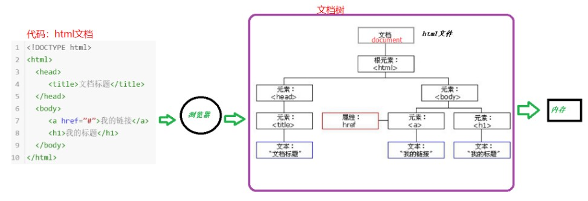

# webAPIs-day01


## 核心知识点

+ 获取元素
+ 注册事件
+ 操作元素的属性


## 1. 回顾JavaScript组成

+ ECMAScript

  + 变量
  + 数据类型
  + 运算符
  + 分支语句、循环
  + 数组
  + 函数（创建函数、调用、参数、返回值）
  + 对象（Object、Array、Date、Math、基本包装（String、Number、Boolean））
    + 属性和方法

+ DOM

  > 文档对象模型

+ BOM

  + 浏览器对象模型

注意：DOM其实是属于BOM的一部分。在实际开发中，DOM操作比重多，而且重要。


## 2. API和webAPI

+ API（==A==pplication ==P==rogramming ==I==nterface）应用程序编程==接口==（暴露出来的工具）。 

+ webAPI：浏览器平台对外公开的提供操作浏览器和网页的接口（BOM、DOM）


## 3. DOM介绍

### 3.1 DOM的概念

> 概念：文档对象模型。【document object model】

​	【JS操作页面元素的一套规则，标准】

> + 文档：html文件
> + 对象：属性和方法
> + 模型：（树）

### 3.2 文档树

> ​	文档树：浏览器在加载html文件时，会把文档、文档中的标签、属性、文本、注释转换成对象，然后按照标签的关系（父子、兄弟、祖孙）以树状结构存储到内存中。
>
>  
>
> 文档树中的对象，也被称为**节点对象**  。
>
> 节点对象的分类：==**文档（document）**==   、==**元素（标签转换的对象）**== 、文本、属性、注释


### 3.3 学DOM要干什么

+ 获取元素
+ 给元素注册事件
+ 操作元素的属性
+ 动态操作元素（创建、追加、删除、克隆等）


## 4. 获取元素

### 4.1 根据id值获取单个元素

> - **语法**： document.getElementById('id值');
>
> - 代码：
>
>   ```html
>     <button id="btn">按钮1</button>
>     <button id="btn">按钮2</button>
>     <script>
>       // 根据id获取单个元素，返回一个元素
>       var btn = document.getElementById('btn');
>       // dir可以打印出对象中的属性和方法
>       console.dir(btn);
>       console.log(btn);
>       // 细节：若页面上有相同的id值的标签时，在获取时，获取的是id值第一次出现的标签。
>     </script>
>   ```
>
>

### 4.2 根据标签名获取一组元素

> + **语法**：==document.getElementsByTagName('标签名');== 
>
> + 代码：
>
>   ```html
>     <button>按钮1</button>
>     <button>按钮2</button>
>     <button>按钮3</button>
>     <button>按钮4</button>
>     <script>
>       // 需求：获取所有按钮
>       // 根据标签名获取一组元素，返回的是一个伪数组
>       var btns = document.getElementsByTagName('button');
>       console.log(btns);
>   
>       // 数组和伪数组的区别？
>       // 相同：都有索引和长度（length）
>       // 不同点：伪数组不能够调用真正数组中内置的方法（push、pop、sort...）
>     </script>
>   ```
>
> 

### 4.3 根据选择器获取单个元素

> + **语法**：==document.querySelector('选择器');== 
>
> + 代码：
>

### 4.4 根据选择器获取一组元素

> - **语法**：==document.querySelectorAll('选择器');== 
>
> - 代码：
>


### 案例：

1. 根据id值获取按钮
2. 根据标签名获取一组li
3. 缩小范围获取元素


## 5. 事件基础

### 5.1 什么是事件

​	用户和网页之间的交互行为（鼠标点击、鼠标进入、鼠标离开、键盘按下、键盘弹起、手指按压、手指移动等等）

### 5.2 事件三要素

+ 事件源：被触发的元素，比如点击的按钮
+ 事件类型：如何触发的事件，比如==点击==按钮 
+ 事件处理程序：事件发生后的结果。

### 5.3 给元素注册事件

+ 语法：事件源.事件类型 = 事件处理程序;

  + 事件源→           触发的那个元素
  + 事件类型→        点击 onclick
  + 事件处理程序→ 函数

+ 代码：

  > ```javascript
  >     // 获取按钮元素
  >     var btn = document.getElementById('btn');
  >     btn.onclick = function(){
  >       // 函数体中的代码，就是事件发生后要执行的程序
  >       alert('燃烧段段的卡路里');
  >     };
  >
  >     // 事件处理程序的本质是什么？
  >     // ① onclick本质上就是事件源这个对象中的某一个键值对而已。默认值是null，表示没有注册事件
  >     // ② 给事件源注册onclick事件，其实本质上就是给onclick赋值函数，所以onclick是事件源的一个方法而已
  >     // ③ 点击按钮时，浏览器自动调用了btn.onclick();
  > ```

### 5.4 事件处理程序中的this

> **事件处理程序中的this指向事件源** 
>
> ```javascript
>     // 获取按钮元素
>     var btn3 = document.getElementById('btn');
>     btn3.onclick = function(){
>       // 函数体中的代码，就是事件发生后要执行的程序
>       // 关键字：this，代表事件源
>       console.log(this);
>     }
> ```


### 5.5 取消a标签默认行为

> 1. 方式1：事件处理程序中最后设置**return false**; 
>
>    ```html
>      <a id="link" href="https://www.baidu.com">点击</a>
>      <script>
>        var link = document.getElementById('link');
>        link.onclick = function(){
>          alert('你好');
>          // 方式1：取消a点击后的默认跳转行为 return false;
>          return false;
>        };
>      </script>
>    ```
>
> 2. 方式2：设置a标签的href属性值为：**javascript:** 
>
>    ```html
>      <!-- 方式二：给a标签的herf值设置javascript: ,表示将来点击a时，会阻止默认跳转行为，并且仅仅会执行js代码-->
>      <a href="javascript:">点击2</a>
>      <!-- 扩展：通过a可以打开打电话应用 -->
>      <a href="tel:">打电话</a>
>      <!-- 扩展：通过a可以打开电子邮件应用 -->
>      <a href="mailto:">打开邮件</a>
>    ```
>
>    
>

### 案例：

1. 点击按钮弹出'你好'
2. 给一组按钮注册事件，点击弹出‘你好’
3. 给a标签注册点击事件，点击弹出'你好'，并且点击a标签不跳转


## 6. 操作元素的属性

### 6.1 语法格式

+ 获取：

  > + **语法：元素.属性名;** 

+ 设置：

  > + **语法：元素.属性名= 值;** 

### 6.2 常见的属性

> id、title、href、src、className、innerText / textContent、innerHTML

+ className操作类名

  > ```html
  >   <div id="box" class="a"></div>
  >   <script>
  >     var div = document.getElementById('box');
  >     // 获取类名
  >     console.log(div.class); // undefined
  >     console.log(div.className);  // a
  >     // 设置类名
  >     div.className = 'b';
  >   </script>
  > ```

+ innerText和innerHTML的区别

  > ```html
  >   <div id="box"><h2>我是div中的标题</h2></div>
  >   <script>
  >     // 1. 获取div元素
  >     var div = document.getElementById('box');
  >     console.dir(div);
  >     // 【获取】
  >     // ① 通过innerText获取,仅仅包含文本
  >     console.log(div.innerText);
  >     // ② 通过innerHTML获取，若有子标签时，会包含文本和子标签
  >     console.log(div.innerHTML);
  >
  >     // 【设置】
  >     // ① 通过innerText设置,若设置中包含了子标签，该标签不会被渲染而是当做普通文本显示
  >     // div.innerText = '<a href="#">我是div中的超链接</a>';
  >     // ② 通过innerHTML设置,若设置中包含了子标签，该标签会被渲染显示
  >     div.innerHTML= '<a href="#">我是div中的超链接</a>';
  >
  >   </script>
  > ```
+ innerText和textContent的兼容性问题

  > ```html
  >   <div id="box"><h2>我是div中的标题</h2></div>
  >   <script>
  >     // 1. 获取div元素
  >     var div = document.getElementById('box');
  >     console.log('innerText:' + div.innerText);
  >     console.log('textContent:' + div.textContent);
  >     // 相同点：获取的都是文本
  >     // 不同点：
  >     // ① textContent属性在ie低版本中不支持，innerText基本没有兼容问题
  >     // ② textContent标准属性（官宣），innerText（野路子，但是兼容性好,推荐使用）
  >
  >   </script>
  > ```


### 案例：

+ 点击a元素切换图片
+ 给一组带有链接地址的a标签注册事件，点击谁就显示谁的地址和名称，不跳转
+ 美女相册


